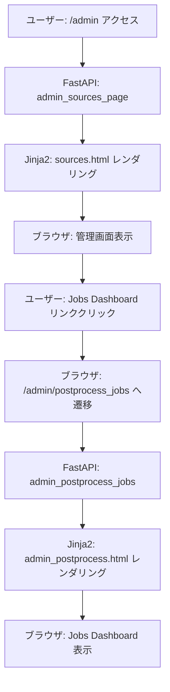
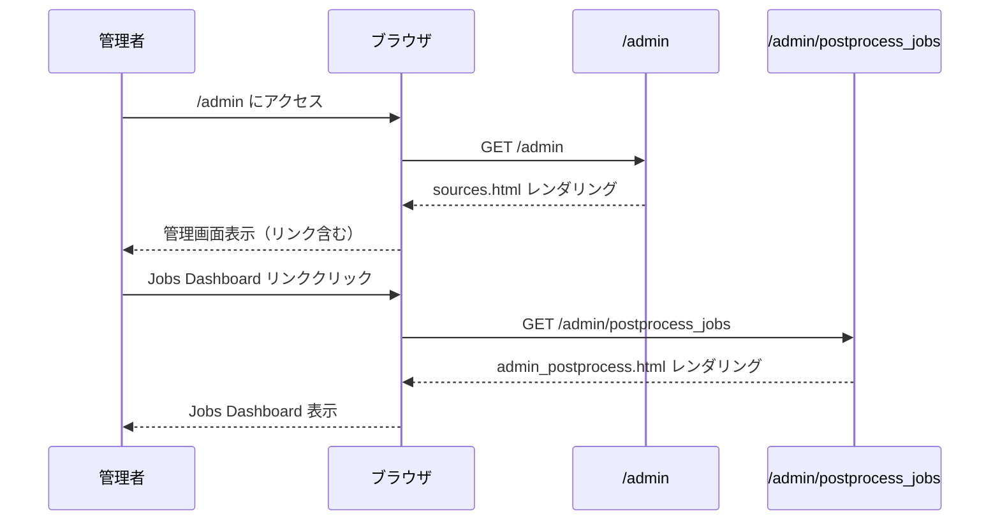
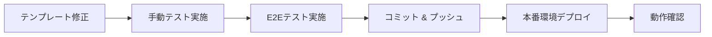

# Technical Design Document

## Overview

この機能は、管理者が既存のソース管理画面（`/admin`）からPostprocess Jobs Dashboard（`/admin/postprocess_jobs`）へ簡単にアクセスできるようにするナビゲーションリンクを追加します。現在、ジョブダッシュボードは実装済みですが、直接URLを入力する必要があり、管理者の運用効率が低下しています。

**ユーザー**: システム管理者が日常的なジョブステータス確認、エラー調査、パフォーマンスモニタリングに使用します。

**影響**: 既存の管理画面テンプレート（`app/templates/admin/sources.html`）にリンク要素を追加しますが、ルーティング、ビジネスロジック、データモデルには変更を加えません。

### Goals

- 管理画面のヘッダーセクションにPostprocess Jobs Dashboardへのナビゲーションリンクを追加
- 既存のUIデザインパターン（Tailwind CSS、Lucide Icons）との一貫性を維持
- アクセシビリティ基準（WCAG 2.1 AA）を満たすリンク実装
- モバイル環境（画面幅 < 768px）でのタップ可能なサイズ確保

### Non-Goals

- Postprocess Jobs Dashboardの機能拡張や改善
- 新しいルーティングエンドポイントの作成
- 管理画面全体のナビゲーション構造の再設計
- 他の管理機能（エクスポート、コレクション管理等）へのリンク追加

## Architecture

### Existing Architecture Analysis

現在の管理画面は以下の構成です：

- **ルーティング**: `/admin` エンドポイントは `app/main.py:288` で定義され、`admin_sources_page` 関数がソース管理画面を提供
- **テンプレート構造**: `app/templates/admin/sources.html` は `base.html` を継承し、Jinja2テンプレートエンジンで動的HTML生成
- **UIフレームワーク**: Tailwind CSS（ユーティリティファーストCSS）とLucide Icons（SVGアイコンライブラリ）を使用
- **レイアウトパターン**: ヘッダー（タイトル＋説明）、検索・フィルターセクション、メインコンテンツ（3列グリッド）、サイドバー（新規作成フォーム）

既存の構造を維持し、ヘッダーセクション内にリンクを追加する最小限の変更を行います。

### High-Level Architecture



### Technology Alignment

この機能は既存の技術スタックと完全に整合します：

- **テンプレートエンジン**: Jinja2（既存）
- **CSSフレームワーク**: Tailwind CSS（既存）
- **アイコンライブラリ**: Lucide Icons（既存の `data-lucide` 属性を使用）
- **HTTPメソッド**: 標準的な `<a>` タグによるGETリクエスト（HTMXは不要）

新しい依存関係やライブラリの追加は不要です。

## System Flows

### User Interaction Flow



## Requirements Traceability

| Requirement | 要件概要 | 実装方法 |
|-------------|----------|----------|
| 1.1 | リンク表示 | `sources.html` ヘッダーセクションに `<a>` タグを追加 |
| 1.2 | ページ遷移 | `href="/admin/postprocess_jobs"` 属性で遷移を実現 |
| 1.3 | 視覚的識別 | Tailwind CSS クラスと Lucide Icons でスタイリング |
| 1.4 | アイコン表示 | `<i data-lucide="activity">` でモニタリングアイコンを表示 |
| 2.1 | デザイン一貫性 | 既存のボタン/リンクと同じ Tailwind クラスを使用 |
| 2.2 | 配置位置 | ヘッダーの右側（ソース件数表示の近く）に配置 |
| 2.3 | 明確なラベル | 「ジョブダッシュボード」テキストラベルを表示 |
| 2.4 | 常時表示 | 条件分岐なしで常に表示（CSS `hidden` なし） |
| 3.1 | タップサイズ | `px-4 py-2` で 44x44px 以上を確保 |
| 3.2 | スクリーンリーダー | `aria-label="Postprocess Jobs Dashboard へ移動"` を追加 |
| 3.3 | キーボードナビゲーション | `<a>` タグは標準でフォーカス可能 |
| 3.4 | フォーカスインジケーター | Tailwind `focus:ring-2 focus:ring-emerald-500` を使用 |
| 4.1 | レイアウト構造維持 | 既存の `<div class="mb-8">` 内に追加 |
| 4.2 | テンプレート継承維持 | `` 構造は変更なし |
| 4.3 | HTMX 互換性 | 標準 `<a>` タグのため HTMX との競合なし |
| 4.4 | 既存機能の動作継続 | テンプレートの他のセクションは変更なし |

## Components and Interfaces

### UI Layer

#### Admin Sources Template (sources.html)

**Responsibility & Boundaries**
- **Primary Responsibility**: 管理画面のHTML構造を定義し、ソース管理機能とナビゲーションリンクを提供
- **Domain Boundary**: プレゼンテーション層（テンプレート）
- **Data Ownership**: テンプレート変数（`sources`, `request`）の表示のみ、データ所有権なし

**Dependencies**
- **Inbound**: `app/main.py:admin_sources_page` からレンダリングされる
- **Outbound**: `base.html` テンプレートを継承、`/admin/postprocess_jobs` エンドポイントへリンク
- **External**: Tailwind CSS（CDN経由）、Lucide Icons（JavaScript経由）

**Contract Definition**

**テンプレート修正箇所**:

```html
<!-- 修正前: app/templates/admin/sources.html (lines 8-17) -->
<div class="mb-8">
  <div class="flex items-center justify-between">
    <div>
      <h1 class="text-3xl font-bold text-gray-900">ソース管理</h1>
      <p class="mt-2 text-gray-600">フィードや外部ソースの登録・スケジュール・有効/無効の管理を行います。</p>
    </div>
    <div class="text-sm text-gray-500">
      合計: <span id="source-count" class="font-semibold text-gray-900">{{ sources|length }}</span> 件
    </div>
  </div>
  <!-- Search and Filter セクションが続く -->
```

**修正後**:

```html
<div class="mb-8">
  <div class="flex items-center justify-between">
    <div>
      <h1 class="text-3xl font-bold text-gray-900">ソース管理</h1>
      <p class="mt-2 text-gray-600">フィードや外部ソースの登録・スケジュール・有効/無効の管理を行います。</p>
    </div>
    <div class="flex items-center gap-4">
      <!-- 新規追加: Jobs Dashboard リンク -->
      <a
        href="/admin/postprocess_jobs"
        class="inline-flex items-center gap-2 px-4 py-2 text-sm font-medium text-gray-700 bg-white border border-gray-300 rounded-md hover:bg-gray-50 focus:outline-none focus:ring-2 focus:ring-emerald-500 focus:ring-offset-2 transition-colors"
        aria-label="Postprocess Jobs Dashboard へ移動"
        title="ジョブダッシュボード"
      >
        <i data-lucide="activity" class="w-4 h-4"></i>
        <span>ジョブダッシュボード</span>
      </a>
      <!-- 既存: ソース件数表示 -->
      <div class="text-sm text-gray-500">
        合計: <span id="source-count" class="font-semibold text-gray-900">{{ sources|length }}</span> 件
      </div>
    </div>
  </div>
  <!-- Search and Filter セクションが続く -->
```

**Tailwind CSS クラス説明**:
- `inline-flex items-center gap-2`: アイコンとテキストを横並びに配置
- `px-4 py-2`: パディングで 44x44px 以上のタップ可能領域を確保
- `text-sm font-medium text-gray-700`: 既存のボタンと同じフォントスタイル
- `bg-white border border-gray-300 rounded-md`: 白背景とグレーのボーダーで視覚的に識別可能
- `hover:bg-gray-50`: ホバー時の背景色変化
- `focus:outline-none focus:ring-2 focus:ring-emerald-500 focus:ring-offset-2`: フォーカス時のリング表示（アクセシビリティ）
- `transition-colors`: 色変化のスムーズなアニメーション

**Lucide Icons 統合**:
- `data-lucide="activity"`: モニタリング/ダッシュボードを表すアイコン（波形グラフ）
- `w-4 h-4`: アイコンサイズ 16x16px（既存のアイコンと同じサイズ）

**アクセシビリティ属性**:
- `aria-label="Postprocess Jobs Dashboard へ移動"`: スクリーンリーダー向けの説明
- `title="ジョブダッシュボード"`: ツールチップ表示（マウスホバー時）

**Integration Strategy**
- **Modification Approach**: 既存テンプレートの最小限の拡張（ヘッダーセクション内に要素追加）
- **Backward Compatibility**: 既存のHTMLレイアウト、CSSクラス、JavaScript動作に影響なし
- **Migration Path**: 変更なし（単一テンプレートの修正のみ）

## Error Handling

### Error Strategy

この機能はナビゲーションリンクの追加のみであり、新しいエラーハンドリングロジックは不要です。既存のエラー処理メカニズムが適用されます。

### Error Categories and Responses

**User Errors (4xx)**:
- **404 Not Found**: ユーザーが `/admin/postprocess_jobs` にアクセスしたが、エンドポイントが存在しない場合
  - **対応**: 既存のルーティング実装（`app/api/routes/admin.py:53`）が正常に動作することを確認
  - **リカバリー**: エンドポイントは実装済みのため、このエラーは発生しない想定

**System Errors (5xx)**:
- **500 Internal Server Error**: テンプレートレンダリングエラー（構文エラー等）
  - **対応**: テンプレート修正後、手動テストで構文エラーがないことを確認
  - **リカバリー**: エラーログを確認し、テンプレートの構文を修正

### Monitoring

既存のログシステム（FastAPI標準ログ）を使用します。新しい監視要件はありません。

## Testing Strategy

### Unit Tests

テンプレート修正のため、ユニットテストは不要です。代わりに、以下のテストアプローチを採用します。

### Integration Tests

**テスト対象**: 管理画面のHTMLレンダリングとリンク動作

1. **管理画面表示テスト**
   - **目的**: `/admin` ページが正常にレンダリングされ、Jobs Dashboard リンクが含まれることを確認
   - **検証**: レスポンスHTML内に `href="/admin/postprocess_jobs"` が存在
   - **実装**: `tests/test_admin.py` に Playwright または HTTPクライアントベースのテストを追加

2. **リンククリック遷移テスト**
   - **目的**: リンククリックで `/admin/postprocess_jobs` へ正常に遷移することを確認
   - **検証**: 遷移後のページが Jobs Dashboard（`admin_postprocess.html`）であることを確認
   - **実装**: Playwright E2Eテストでリンククリックをシミュレート

3. **既存機能の回帰テスト**
   - **目的**: テンプレート修正後も既存の管理機能（ソース作成、編集、削除等）が正常動作することを確認
   - **検証**: 既存の `tests/test_admin*.py` テストが全てパスすることを確認

### E2E/UI Tests

**テスト対象**: 実際のブラウザでのユーザー操作

1. **視覚的回帰テスト**
   - **目的**: リンク追加後のレイアウトが意図通りに表示されることを確認
   - **検証**: スクリーンショット比較または視覚的検査
   - **実装**: Playwright スクリーンショットテスト

2. **レスポンシブデザインテスト**
   - **目的**: モバイル環境（画面幅 < 768px）でリンクが適切なサイズで表示されることを確認
   - **検証**: デバイスエミュレーションでタップ可能領域が 44x44px 以上
   - **実装**: Playwright モバイルビューポートテスト

3. **アクセシビリティテスト**
   - **目的**: キーボードナビゲーション、スクリーンリーダー対応を確認
   - **検証**: Tab キーでリンクにフォーカス可能、`aria-label` が読み上げられる
   - **実装**: axe-core または Playwright アクセシビリティテスト

### Performance/Load

この機能はパフォーマンスへの影響がないため、負荷テストは不要です。

## Security Considerations

### 認証・認可

現在、`/admin` および `/admin/postprocess_jobs` エンドポイントには認証・認可機能が実装されていません。この機能追加により、セキュリティリスクが増加することはありませんが、将来的な改善として以下を推奨します：

- **推奨**: 管理画面全体に認証ミドルウェアを導入（例: FastAPI Depends による管理者ロール確認）
- **現状**: ローカル環境またはプライベートネットワークでの運用を前提とした実装

### XSS 対策

Jinja2 テンプレートエンジンは標準でHTMLエスケープを行うため、XSS脆弱性のリスクは低いです。

- **検証**: リンクのテキストラベル「ジョブダッシュボード」は静的文字列のため、XSSリスクなし
- **対応**: 追加対応不要

## Migration Strategy

この機能は単一テンプレートファイルの修正のみであり、マイグレーション戦略は不要です。

**デプロイ手順**:



**Rollback Plan**:
- テンプレートファイルの Git リバートで即座にロールバック可能
- データベーススキーマやAPIエンドポイントの変更がないため、ロールバックリスクは最小
