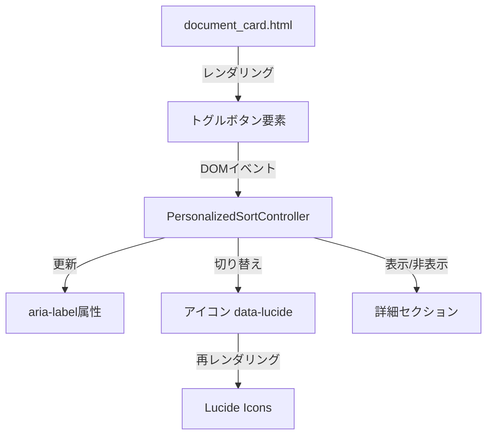
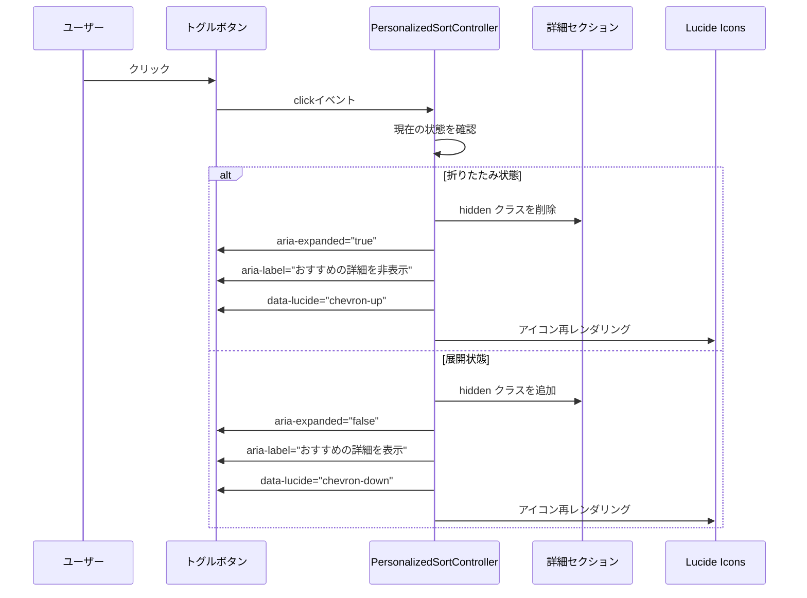

# 技術設計書

## Overview

**目的**: この機能は、記事カードのパーソナライズ情報セクションのトグルボタンからテキストラベルを削除し、アイコンのみのUIに変更することで、視覚的にクリーンなデザインを実現します。

**ユーザー**: すべてのエンドユーザーが、記事カード上でパーソナライズ情報の詳細を展開・折りたたみする際に利用します。

**影響**: 既存のテンプレートとJavaScriptコードを変更し、テキストラベル要素を削除してアイコンのみで機能するトグルボタンに変更します。

### Goals
- テキストラベル「詳細を表示」「詳細を非表示」をUIから削除し、アイコンのみで表現
- アクセシビリティ（aria-label、aria-expanded）を完全に維持
- 既存のトグル機能とアニメーション効果を保持
- 既存のスタイル（色、ホバー効果、トランジション）との整合性を維持

### Non-Goals
- トグルボタンの機能やロジックの変更
- パーソナライズ情報セクション以外のUI要素への影響
- 新しいアニメーションやインタラクション効果の追加

## Architecture

### 既存アーキテクチャの分析

現在の実装は、テンプレート駆動型のフロントエンドアーキテクチャを採用しており、以下の構造で構成されています：

- **テンプレート層**: Jinja2テンプレート（`document_card.html`）がHTML構造を定義
- **プレゼンテーション層**: Tailwind CSSによるユーティリティファーストスタイリング
- **インタラクション層**: Vanilla JavaScriptによるDOMイベントハンドリング（`personalized-sort.js`）
- **アイコンシステム**: Lucideアイコンライブラリを動的にレンダリング

**既存のドメイン境界**:
- パーソナライズ機能モジュール（PersonalizedSortController）
- 記事カードコンポーネント（document_card.html partial）

**保持すべき統合ポイント**:
- Lucideアイコンシステムとの連携
- PersonalizedSortControllerのトグル機能
- Tailwind CSSデザインシステム

### 高レベルアーキテクチャ



### 技術スタック整合性

この機能は既存の技術スタックに完全に準拠します：

- **フロントエンド**: Jinja2テンプレート + Tailwind CSS + Vanilla JavaScript（変更なし）
- **アイコンシステム**: Lucide Icons（既存利用を継続）
- **依存関係**: 新しい外部ライブラリの追加なし

**変更範囲**:
- テンプレート: `<span data-personalized-toggle-text>` 要素の削除
- JavaScript: `toggleText` 要素への参照と更新ロジックの削除

## システムフロー

### ユーザーインタラクションシーケンス



## 要件トレーサビリティ

| 要件 | 要件概要 | コンポーネント | インターフェース | フロー |
|------|----------|--------------|-----------------|--------|
| 1.1 | テキスト非表示、アイコンのみ表示 | document_card.html | `<button data-personalized-toggle>` | - |
| 1.2 | 閉じた状態でchevron-down表示 | personalized-sort.js | `toggleIcon.setAttribute("data-lucide", "chevron-down")` | インタラクションシーケンス |
| 1.3 | 開いた状態でchevron-up表示 | personalized-sort.js | `toggleIcon.setAttribute("data-lucide", "chevron-up")` | インタラクションシーケンス |
| 1.4 | ヘッダー右端に配置 | document_card.html | `class="ml-auto"` | - |
| 2.1 | aria-label「詳細を表示」 | personalized-sort.js | `toggleButton.setAttribute("aria-label", "...")` | インタラクションシーケンス |
| 2.2 | aria-label動的更新 | personalized-sort.js | `toggleButton.setAttribute("aria-label", "...")` | インタラクションシーケンス |
| 2.3 | aria-expanded更新 | personalized-sort.js | `toggleButton.setAttribute("aria-expanded", "...")` | インタラクションシーケンス |
| 3.1 | 詳細セクション表示/非表示切り替え | personalized-sort.js | `detailsEl.classList.toggle("hidden")` | インタラクションシーケンス |
| 3.2 | アイコン切り替え | personalized-sort.js | `toggleIcon.setAttribute("data-lucide", ...)` | インタラクションシーケンス |
| 3.3 | スムーズアニメーション | document_card.html | `transition-colors` | - |
| 4.1 | 既存テキスト色維持 | document_card.html | `text-graphite hover:text-emerald-700` | - |
| 4.2 | ホバー効果維持 | document_card.html | `transition-colors` | - |
| 4.3 | アイコンサイズ設定 | document_card.html | `w-4 h-4` (既存) | - |

## Components and Interfaces

### フロントエンドコンポーネント

#### document_card.html（記事カードテンプレート）

**責任と境界**
- **主要責任**: 記事カードのHTML構造とトグルボタンのマークアップを定義
- **ドメイン境界**: プレゼンテーション層（テンプレートレンダリング）
- **データ所有**: なし（サーバーサイドから渡されたdocumentオブジェクトを表示）

**依存関係**
- **インバウンド**: Flaskルートからのテンプレートレンダリング
- **アウトバウンド**: Lucide Iconsライブラリ、personalized-sort.js
- **外部**: Tailwind CSS、Lucide Icons CDN

**契約定義**

変更対象のHTMLマークアップ:

**変更前**:
```html
<button
    type="button"
    class="ml-auto inline-flex items-center gap-1 px-2 py-0.5 text-xs text-graphite hover:text-emerald-700 transition-colors"
    data-personalized-toggle
    aria-expanded="false"
    aria-label="おすすめの詳細を表示">
    <span data-personalized-toggle-text>詳細を表示</span>
    <i data-lucide="chevron-down" class="w-3 h-3" data-personalized-toggle-icon></i>
</button>
```

**変更後**:
```html
<button
    type="button"
    class="ml-auto text-graphite hover:text-emerald-700 transition-colors cursor-pointer"
    style="background: none !important; border: none !important; padding: 0 !important; margin: 0 !important; outline: none !important;"
    data-personalized-toggle
    aria-expanded="false"
    aria-label="おすすめの詳細を表示">
    <i data-lucide="chevron-down" class="w-4 h-4" data-personalized-toggle-icon></i>
</button>
```

**主要変更点**:
- `<span data-personalized-toggle-text>` 要素を完全削除
- ボタンスタイルのクラスを削除（`inline-flex items-center px-2 py-0.5 text-xs`）
- アイコンサイズを `w-3 h-3` から `w-4 h-4` に拡大（視認性向上）
- **CSS競合対策**: インラインスタイルに`!important`を使用してボタンの見た目を完全にリセット

**CSS優先順位の問題と解決策**:
このプロジェクトでは`app/static/css/style.css`にグローバルなボタンスタイルが定義されており、Tailwindクラスだけではボタンのデフォルトスタイル（背景、ボーダー、パディング）を完全に上書きできません。そのため、以下のインラインスタイルを使用して強制的にリセットします：

```css
background: none !important;
border: none !important;
padding: 0 !important;
margin: 0 !important;
outline: none !important;
```

この問題はプロジェクト全体に存在するため、同様のアイコンのみのボタンを実装する際は、インラインスタイルでの`!important`使用が推奨されます。

**前提条件**:
- Lucideアイコンライブラリがロード済み
- personalized-sort.jsが正常に実行されている

**事後条件**:
- トグルボタンはアイコンのみを表示
- aria-label属性により、スクリーンリーダーで機能を説明

**不変条件**:
- `data-personalized-toggle` 属性は常に存在
- `aria-expanded` 属性は常に "true" または "false"

#### PersonalizedSortController（personalized-sort.js）

**責任と境界**
- **主要責任**: トグルボタンのクリックイベント処理とDOM状態の更新
- **ドメイン境界**: インタラクション層（クライアントサイドロジック）
- **データ所有**: トグル状態（DOM aria-expanded属性）

**依存関係**
- **インバウンド**: ユーザーのクリックイベント
- **アウトバウンド**: DOM API、Lucide Icons（アイコン再レンダリング）
- **外部**: Lucide Icons（`lucide.createIcons()`）

**契約定義**

**変更対象メソッド**: `setupToggleButton(block)`

**変更前ロジック**:
```javascript
// 展開時
toggleText.textContent = "詳細を非表示";
toggleIcon.setAttribute("data-lucide", "chevron-up");

// 折りたたみ時
toggleText.textContent = "詳細を表示";
toggleIcon.setAttribute("data-lucide", "chevron-down");
```

**変更後ロジック**:
```javascript
// toggleText要素への参照と更新処理を完全削除
// アイコン更新のみ保持

// 展開時
toggleIcon.setAttribute("data-lucide", "chevron-up");

// 折りたたみ時
toggleIcon.setAttribute("data-lucide", "chevron-down");
```

**主要変更点**:
1. `toggleText` 変数の宣言と取得処理を削除
2. `toggleText.textContent` への更新処理を削除
3. `toggleText` が存在しない場合のnullチェック削除

**前提条件**:
- `toggleButton` と `detailsEl` がDOM内に存在
- `toggleIcon` 要素が存在（必須）

**事後条件**:
- aria-expanded属性が正しく更新される
- aria-label属性が状態に応じて更新される
- アイコンがchevron-downとchevron-upの間で切り替わる
- Lucideアイコンが再レンダリングされる

**統合戦略**:
- **変更アプローチ**: 既存コードを最小限修正（テキスト関連処理のみ削除）
- **後方互換性**: テンプレート変更後も、JavaScript側でtoggleTextがnullの場合でも正常動作するよう安全に処理
- **移行パス**: テンプレート変更とJavaScript変更を同時デプロイ

## エラーハンドリング

### エラー戦略

この機能は既存のエラーハンドリング戦略を継承し、クライアントサイドの防御的プログラミングを維持します。

### エラーカテゴリと対応

**システムエラー**:
- **DOM要素欠落**: `toggleButton` または `toggleIcon` が見つからない場合、`setupToggleButton` 関数は早期リターンし、エラーをスローしない（既存の動作を維持）
- **Lucideアイコンレンダリング失敗**: アイコンが表示されない場合でも、機能は動作継続（視覚的な問題のみ）

**ユーザーエラー**:
- 該当なし（このUIは入力を受け付けない）

**ビジネスロジックエラー**:
- 該当なし（状態管理のみ）

### モニタリング

既存のクライアントサイドエラー追跡メカニズムを利用します。特別な追加モニタリングは不要です。

## テスト戦略

### 単体テスト

該当なし（JavaScriptの単体テストフレームワークが現在セットアップされていない）

### 統合テスト

手動テストシナリオ:

1. **トグルボタンのアイコンのみ表示確認**
   - 記事カード上のパーソナライズ情報セクションを表示
   - トグルボタンにテキストラベルがなく、アイコンのみが表示されることを確認

2. **トグル機能の動作確認**
   - トグルボタンをクリック
   - 詳細セクションが展開されることを確認
   - アイコンがchevron-upに変更されることを確認
   - 再度クリックして折りたたまれることを確認
   - アイコンがchevron-downに戻ることを確認

3. **aria-label動的更新の確認**
   - ブラウザの開発者ツールでaria-label属性を確認
   - 閉じた状態: "おすすめの詳細を表示"
   - 開いた状態: "おすすめの詳細を非表示"

4. **スタイル整合性の確認**
   - ホバー時にtext-emerald-700色に変化することを確認
   - transition-colorsアニメーションが滑らかに動作することを確認
   - アイコンサイズ（w-4 h-4）が適切であることを確認

### E2Eテスト

手動テストシナリオ:

1. **複数記事カードでの動作確認**
   - 複数の記事カードが表示されたページで、各カードのトグルボタンが独立して動作することを確認

2. **アクセシビリティテスト**
   - スクリーンリーダー（VoiceOverまたはNVDA）でaria-labelが正しく読み上げられることを確認
   - キーボードナビゲーション（Tab、Enter）でトグルボタンが操作可能であることを確認

3. **レスポンシブデザイン確認**
   - モバイル、タブレット、デスクトップ各サイズでアイコンボタンが適切に表示されることを確認

## セキュリティ考慮事項

この変更はUI表示のみに影響し、セキュリティリスクは発生しません。

- データ処理なし
- 認証・認可への影響なし
- 外部APIコールなし

## パフォーマンス & スケーラビリティ

この変更はパフォーマンスに軽微な正の影響を与えます：

- **DOM要素削減**: `<span data-personalized-toggle-text>` 要素の削除により、DOM構造が簡略化
- **JavaScript処理削減**: `toggleText.textContent` 更新処理の削除により、DOM操作が減少
- **レンダリング影響**: 最小限（記事カード1枚あたりのDOM要素が1つ減少）

**測定可能な影響**: 無視できるレベル（数ミリ秒未満）
