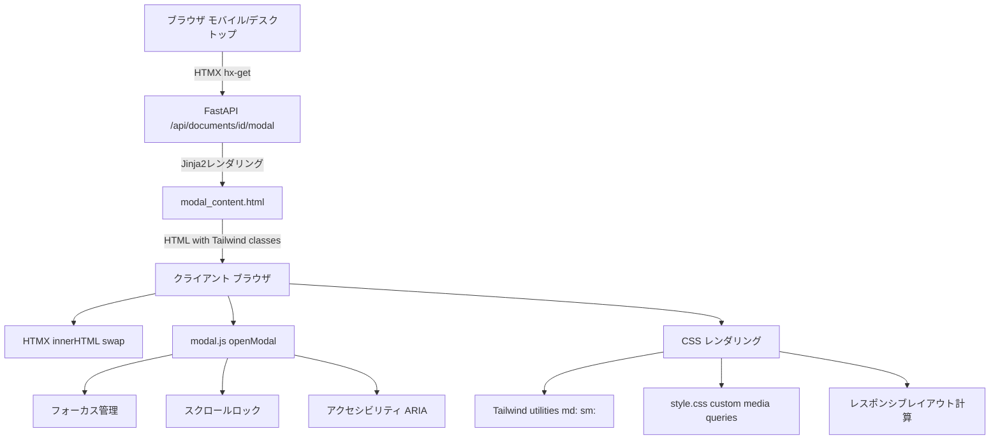
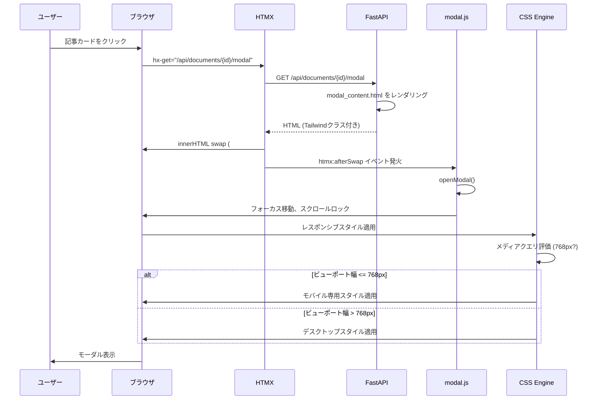

# 技術設計ドキュメント

## 概要

本機能は、記事詳細モーダルをモバイルデバイス（768px以下）でも快適に閲覧できるようレスポンシブ対応を実装する。現在のデスクトップ中心の実装では、モバイル画面でレイアウト崩れ、ラベルの改行、ヘッダの過剰な高さなどの問題が発生している。この設計では、既存のHTMXベースのモーダル機構を維持しながら、CSSのみでレスポンシブ対応を実現する。

**目的**: モバイルユーザーに対して、デスクトップと同等の記事閲覧体験を提供し、レイアウト崩れやスクロール問題を解消する。

**ユーザー**: Scrap-Boardの全ユーザー（特にモバイルデバイスからアクセスするユーザー）が、記事一覧から記事詳細を閲覧する際に利用する。

**影響**: 既存のモーダル実装（`app/templates/partials/modal_content.html`, `app/static/js/modal.js`, `app/static/css/style.css`）に対して、CSSの追加とHTMLクラスの調整のみを行う。JavaScriptロジックやHTMX属性は変更しない。

### ゴール

- モバイル画面（768px以下）で記事詳細モーダルを開いたときに、横スクロールなしで全コンテンツが表示される
- カテゴリ・タグラベルが意図しない改行をせず、必要に応じて省略記号で切り詰められる
- モバイル画面でのヘッダ高さを56px以内に抑え、コンテンツ閲覧領域を最大化する
- 既存のデスクトップ表示を劣化させず、互換性を維持する
- 60fps以上のスムーズなスクロールとアニメーションを実現する

### 非ゴール

- モーダルの開閉ロジックの変更（既存のHTMX + JavaScript実装を維持）
- デスクトップレイアウトの刷新（現在のレイアウトを保持）
- モーダルコンテンツの機能追加（ブックマーク、Reader Mode等の既存機能は変更なし）
- サーバーサイドロジックの変更（APIエンドポイントやテンプレートレンダリングロジックは変更なし）

## アーキテクチャ

### 既存アーキテクチャ分析

現在のモーダル実装は以下のパターンで構成されている:

- **サーバーサイドレンダリング**: Jinja2テンプレート（`modal_content.html`）でHTMLを生成
- **HTMX駆動のモーダル取得**: `hx-get="/api/documents/{id}/modal"` で記事詳細をAJAX取得し、`#modal-container`に挿入
- **Vanilla JavaScriptによる状態管理**: `app/static/js/modal.js` でモーダルの開閉、フォーカストラップ、スクロールロックを制御
- **Tailwind CSS + カスタムCSS**: ユーティリティクラスとグローバルスタイル（`style.css`）の組み合わせ

**既存の技術的境界**:
- モーダルHTMLは `app/templates/partials/modal_content.html` で完結
- モーダルの開閉状態は `modal.js` の `openModal()` / `closeModal()` で管理
- スタイリングは `style.css` のグローバルルールと Tailwind ユーティリティクラスで定義

**統合ポイント**:
- `modal_content.html` のクラス属性に Tailwind レスポンシブプレフィックス（`md:`, `sm:`）を追加
- `style.css` にモーダル専用のメディアクエリセクションを追加

### 高レベルアーキテクチャ

レスポンシブ対応は既存のレイヤーに以下の変更を加える:



### 技術アライメント

**既存パターンの保持**:
- **HTMX駆動のコンテンツ取得**: モーダルコンテンツは引き続きサーバーサイドでレンダリングし、HTMX経由で取得
- **Vanilla JavaScriptによる状態管理**: `modal.js` の開閉ロジック、フォーカストラップ、スクロールロックは変更なし
- **Tailwind CSS + カスタムCSS**: 既存のスタイリングアプローチを継承し、メディアクエリを追加

**新規コンポーネントの導入理由**:
- なし（CSSのみの変更のため、新規コンポーネントは導入しない）

**技術スタックとの整合性**:
- Tailwind CSSのレスポンシブプレフィックス（`md:`, `sm:`）を活用
- `style.css` にモーダル専用のメディアクエリを追加（既存のグローバルスタイルとの競合を回避）

**ステアリング準拠**:
- **structure.md**: テンプレート層（`app/templates/partials`）とスタイル層（`app/static/css`）のみを変更
- **tech.md**: Tailwind CSS + カスタムCSSのアプローチを維持、JavaScriptの変更なし
- **product.md**: 既存のモーダル機能（ブックマーク、Reader Mode、類似記事）は保持

### 主要な設計決定

#### 決定1: CSSのみでレスポンシブ対応を実装

**コンテキスト**: モバイル画面でのレイアウト崩れを解決する必要がある。JavaScript でビューポート幅を検出して動的にクラスを変更する方法と、CSSメディアクエリで対応する方法がある。

**代替案**:
1. **JavaScriptによる動的クラス変更**: `window.matchMedia` でビューポート幅を検出し、クラスを動的に追加/削除
2. **CSSメディアクエリ**: `@media (max-width: 768px)` でモバイル専用スタイルを定義
3. **コンテナクエリ**: CSS Container Queries を使用してモーダルコンテナのサイズに応じたスタイルを適用

**選択したアプローチ**: CSSメディアクエリ（代替案2）

**根拠**:
- **パフォーマンス**: CSSメディアクエリはブラウザのレイアウトエンジンで最適化されており、JavaScriptよりもリフローが少ない
- **保守性**: `modal.js` を変更する必要がなく、既存のロジックを保持できる
- **宣言的**: スタイルがCSS内で完結し、HTMLとJavaScriptとの結合度が低い
- **ブラウザ互換性**: メディアクエリは iOS Safari 14+, Chrome Mobile 90+ で完全にサポートされている（コンテナクエリは iOS Safari 16+ が必要）

**トレードオフ**:
- **利点**: パフォーマンス、保守性、ブラウザ互換性
- **欠点**: 複雑な条件分岐（例: 特定のデバイスのみ特別扱い）はメディアクエリでは困難（ただし、本要件では単純な幅ベースの分岐のみで十分）

#### 決定2: Tailwind ユーティリティクラスとカスタムCSSの併用

**コンテキスト**: Tailwind CSS はユーティリティクラスでレスポンシブ対応を簡潔に記述できるが、複雑なセレクタや既存のグローバルスタイルとの競合がある。

**代替案**:
1. **Tailwind のみ**: すべてのスタイルを Tailwind のユーティリティクラスで記述
2. **カスタムCSSのみ**: `style.css` にすべてのスタイルを記述し、Tailwind を使用しない
3. **Tailwind + カスタムCSSの併用**: 基本スタイルは Tailwind、複雑なセレクタやメディアクエリは `style.css`

**選択したアプローチ**: Tailwind + カスタムCSSの併用（代替案3）

**根拠**:
- **既存パターンとの一貫性**: プロジェクトは既に Tailwind とカスタムCSSを併用している
- **柔軟性**: Tailwind で簡潔に記述できる部分はユーティリティクラス、複雑なセレクタ（例: `.modal-content [data-modal-dialog] > .p-6`）はカスタムCSS
- **グローバルスタイルとの競合回避**: `style.css` のモーダル専用セクションでスコープを限定

**トレードオフ**:
- **利点**: 既存パターンとの一貫性、柔軟性、グローバルスタイルとの共存
- **欠点**: Tailwind とカスタムCSSの境界が曖昧になる可能性（明確なルールで回避）

#### 決定3: ラベルのオーバーフロー処理に `title` 属性を使用

**コンテキスト**: 長いカテゴリ名やタグ名が省略記号で切り詰められた場合、ユーザーが完全なテキストを確認できる手段が必要。

**代替案**:
1. **`title` 属性**: HTML標準の `title` 属性でブラウザネイティブのツールチップを表示
2. **カスタムツールチップ**: JavaScript + CSS で独自のツールチップを実装
3. **展開ボタン**: クリックでラベルを展開する UI を追加

**選択したアプローチ**: `title` 属性（代替案1）

**根拠**:
- **シンプル**: HTMLのみで実装でき、JavaScriptの追加が不要
- **アクセシビリティ**: スクリーンリーダーが `title` 属性を読み上げる（ただし、`aria-label` も併用）
- **モバイル対応**: ロングタップで `title` 属性の内容が表示される（iOS Safari、Chrome Mobile）
- **非侵襲的**: 既存のJavaScriptロジックに影響しない

**トレードオフ**:
- **利点**: シンプル、アクセシビリティ、モバイル対応
- **欠点**: ツールチップのスタイルをカスタマイズできない（ブラウザのデフォルトスタイル）

## システムフロー

レスポンシブ対応はスタイリング層のみの変更のため、複雑なフローは発生しない。以下は、モーダル表示時のレンダリングフローを示す。



## 要件トレーサビリティ

| 要件 | 要件サマリー | コンポーネント | インターフェース | 備考 |
|------|------------|--------------|----------------|------|
| 1.1 | 横スクロール防止 | modal_content.html, style.css | Tailwind `w-full`, `max-w-full`, カスタムメディアクエリ | ヘッダ、コンテンツ、フッターに `max-w-full` を適用 |
| 1.2 | セクション区別 | modal_content.html | Tailwind `border-b`, `p-4` | 既存の `border-b` を維持、パディングをモバイルで削減 |
| 1.3 | 画像のレスポンシブ縮小 | modal_content.html | Tailwind `w-full`, `h-auto`, `object-cover` | サムネイルに `max-w-full` を追加 |
| 1.4 | モーダル内スクロール | modal.js, style.css | `overflow-y: auto`, `-webkit-overflow-scrolling: touch` | 既存の実装を維持、慣性スクロールを追加 |
| 2.1 | ラベルの改行防止 | modal_content.html, style.css | `white-space: nowrap` | カテゴリ・タグに適用 |
| 2.2 | ellipsis表示 | style.css | `text-overflow: ellipsis`, `overflow: hidden` | ラベルコンテナに適用 |
| 2.3 | ツールチップ表示 | modal_content.html | `title` 属性, `aria-label` 属性 | Jinja2テンプレートで属性を追加 |
| 2.4 | ラベルコンテナの折り返し | modal_content.html | Tailwind `flex-wrap` | 既存の `flex` に `flex-wrap` を追加 |
| 3.1 | ヘッダパディング削減 | modal_content.html | Tailwind `md:p-6 p-4` | モバイルで `p-4` に削減 |
| 3.2 | タイトルフォントサイズ調整 | style.css | メディアクエリで `font-size: 1rem` | モバイルで小さくする |
| 3.3 | ヘッダ高さ56px以内 | style.css | メディアクエリで `line-height` 調整 | 要素間マージン削減 |
| 3.4 | 二次メタデータの1行表示 | modal_content.html | Tailwind `text-xs`, `truncate` | メタデータを1行に要約 |
| 4.1 | タッチターゲット44x44px | style.css | `min-width: 44px`, `min-height: 44px` | ボタンに適用 |
| 4.2 | 慣性スクロール | style.css | `-webkit-overflow-scrolling: touch` | スクロール領域に適用 |
| 4.3 | スクリーンリーダー対応 | modal_content.html | `aria-label`, `title` 属性 | ラベルに適用 |
| 4.4 | キーボードフォーカス表示 | style.css | `focus:outline`, `focus:ring` | 既存のフォーカススタイルを維持 |
| 5.1 | モーダル専用セレクタ | style.css | `.modal-content`, `[data-modal-dialog]` | スコープを限定 |
| 5.2 | Tailwindメディアクエリ | modal_content.html | `md:`, `sm:` プレフィックス | レスポンシブクラスを使用 |
| 5.3 | グローバルスタイル保護 | style.css | モーダル専用セクションで定義 | `!important` を最小限に |
| 5.4 | `!important` の明示 | style.css | コメントで理由を記載 | 必要最小限の使用 |
| 6.1 | デスクトップレイアウト維持 | modal_content.html, style.css | `md:max-w-4xl`, `md:mx-auto` | 既存のデスクトップスタイルを保持 |
| 6.2 | デスクトップパディング維持 | modal_content.html | `md:p-6` | デスクトップで `p-6` を維持 |
| 6.3 | メディアクエリスコープ | style.css | `@media (max-width: 768px)` | モバイル専用スタイルのみ |
| 6.4 | E2Eテストのパス | tests/test_*_ui.py | Playwrightテスト | 既存テストを変更なし |
| 7.1 | 300ms以内レンダリング | style.css | GPU加速 (`transform`, `opacity`) | リフロー回避 |
| 7.2 | 60fps アニメーション | style.css | CSS `transition` | `transition` プロパティ使用 |
| 7.3 | GPU加速 | style.css | `will-change`, `transform: translateZ(0)` | 必要に応じて適用 |
| 7.4 | リフロー回避 | style.css | `transform`, `opacity` 優先 | 幅や高さの変更を避ける |

## コンポーネントとインターフェース

### プレゼンテーション層

#### modal_content.html (Jinja2 テンプレート)

**責務と境界**
- **主要責務**: 記事詳細モーダルのHTML構造を定義し、レスポンシブ対応のTailwindクラスを適用
- **ドメイン境界**: プレゼンテーション層（ビュー）
- **データ所有権**: なし（サーバーから渡された `document` オブジェクトを表示）
- **トランザクション境界**: なし（表示のみ）

**依存関係**
- **インバウンド**: FastAPI ルーター（`/api/documents/{id}/modal`）
- **アウトバウンド**: なし
- **外部**: Tailwind CSS（CDN経由）、Lucide Icons（CDN経由）

**契約定義**

テンプレートは Jinja2 コンテキスト変数 `document` を受け取り、HTMLを生成する。

**入力コンテキスト**:
```python
{
  "document": Document  # SQLAlchemyモデル
}
```

**出力HTML構造**:
```html
<div class="relative bg-white rounded-lg w-full h-full md:max-w-4xl md:w-auto md:h-auto md:max-h-[85vh] md:mx-auto md:my-8 flex flex-col" data-modal-dialog>
  <!-- ヘッダ -->
  <div class="flex items-start justify-between p-4 md:p-6 border-b flex-shrink-0">
    <!-- タイトル、メタデータ -->
  </div>
  <!-- コンテンツ -->
  <div class="p-4 md:p-6 overflow-y-auto flex-1 min-h-0 max-h-[60vh]" data-modal-scrollable>
    <!-- カテゴリ、タグ、要約、本文プレビュー、類似記事 -->
  </div>
  <!-- フッター -->
  <div class="flex items-center justify-between p-4 md:p-6 border-t flex-shrink-0">
    <!-- アクションボタン -->
  </div>
</div>
```

**変更内容**:
1. **ヘッダパディング**: `p-6` → `p-4 md:p-6` に変更
2. **コンテンツパディング**: `p-6` → `p-4 md:p-6` に変更
3. **フッターパディング**: `p-6` → `p-4 md:p-6` に変更
4. **ラベルコンテナ**: `flex-wrap` を追加、個々のラベルに `truncate` と `title` 属性を追加
5. **サムネイル**: `max-w-full` を追加

**事前条件**: FastAPI ルーターが有効な `Document` オブジェクトを渡す

**事後条件**: 有効なHTMLが生成され、HTMXによって `#modal-container` に挿入される

**不変条件**: HTML構造が `modal.js` の期待する構造（`[data-modal-dialog]`, `[data-modal-close]`, `[data-modal-scrollable]`）を維持する

#### style.css (カスタムCSS)

**責務と境界**
- **主要責務**: モーダルのレスポンシブスタイルを定義し、モバイル画面でのレイアウト崩れを防止
- **ドメイン境界**: プレゼンテーション層（スタイル）
- **データ所有権**: なし
- **トランザクション境界**: なし

**依存関係**
- **インバウンド**: ブラウザのCSSエンジン
- **アウトバウンド**: なし
- **外部**: なし

**契約定義**

**追加するCSSルール**:

```css
/* ===========================================
   Modal Responsive Styles
   モバイル画面（768px以下）でのレイアウト最適化
   =========================================== */

/* モバイル画面でのモーダルダイアログ */
@media (max-width: 768px) {
  /* ヘッダのタイトルフォントサイズを削減 */
  [data-modal-dialog] .dify-title {
    font-size: 1rem; /* デスクトップ: 1.75rem */
    line-height: 1.2;
  }

  /* メタデータバッジのフォントサイズを削減 */
  [data-modal-dialog] .dify-meta-badge {
    font-size: 0.75rem; /* デスクトップ: 0.875rem */
    padding: 0.25rem 0.5rem;
  }

  /* ラベルの改行防止とオーバーフロー処理 */
  [data-modal-dialog] .tag-list {
    flex-wrap: wrap; /* 複数行への折り返しを許可 */
  }

  [data-modal-dialog] .dify-tag-primary,
  [data-modal-dialog] .dify-tag-secondary {
    white-space: nowrap; /* 個々のラベル内では改行しない */
    overflow: hidden;
    text-overflow: ellipsis;
    max-width: 150px; /* 最大幅を制限 */
  }

  /* ボタンのタッチターゲットサイズを確保 */
  [data-modal-dialog] button,
  [data-modal-dialog] a.btn {
    min-width: 44px;
    min-height: 44px;
    padding: 0.5rem 0.75rem; /* 既存のパディングよりわずかに縮小 */
  }

  /* スクロール領域の慣性スクロール有効化 */
  [data-modal-scrollable] {
    -webkit-overflow-scrolling: touch;
  }

  /* ヘッダとフッターのパディング削減（Tailwindで対応済みだが、フォールバック） */
  [data-modal-dialog] > .flex.items-start.justify-between.border-b,
  [data-modal-dialog] > .flex.items-center.justify-between.border-t {
    padding: 1rem !important; /* Tailwind の p-4 (1rem) を強制 */
  }

  /* サムネイル画像のレスポンシブ縮小 */
  [data-modal-dialog] .dify-thumb {
    max-width: 100%;
    height: auto;
  }
}

/* GPU加速を有効化（パフォーマンス最適化） */
[data-modal-dialog] {
  will-change: transform, opacity;
  transform: translateZ(0); /* GPUレイヤーに分離 */
}

/* フォーカススタイルの明示（アクセシビリティ） */
[data-modal-dialog] button:focus,
[data-modal-dialog] a:focus {
  outline: 2px solid #3b82f6; /* Tailwind blue-500 */
  outline-offset: 2px;
}
```

**変更範囲**: `style.css` の末尾に新規セクションとして追加（既存のスタイルは変更なし）

**競合回避**: セレクタを `[data-modal-dialog]` でスコープし、グローバルスタイルとの競合を防止

**`!important` の使用理由**:
- ヘッダ・フッターのパディングは、Tailwindクラスとカスタムグローバルスタイルの競合があるため、`!important` で強制（最小限の使用）

#### modal.js (JavaScript)

**責務と境界**
- **主要責務**: モーダルの開閉、フォーカストラップ、スクロールロック、ARIA属性の管理
- **ドメイン境界**: プレゼンテーション層（インタラクション）
- **データ所有権**: モーダルの開閉状態（`previousFocusElement`）
- **トランザクション境界**: なし

**依存関係**
- **インバウンド**: HTMX（`htmx:afterSwap`, `htmx:responseError`）、ブラウザイベント（`keydown`, `popstate`）
- **アウトバウンド**: なし
- **外部**: HTMX（CDN経由）、Lucide Icons（CDN経由）、`markdown-preview.js`

**契約定義**

本設計では `modal.js` の変更は不要。既存のインターフェースを維持する。

**公開API**:
```typescript
interface ModalManager {
  open(): void;
  close(skipHistoryUpdate?: boolean): void;
}
```

**事前条件**:
- `#modal-container` が DOM に存在する
- HTMX が初期化されている

**事後条件**:
- `openModal()`: モーダルが表示され、フォーカスがモーダル内に移動し、背景スクロールがロックされる
- `closeModal()`: モーダルが非表示になり、フォーカスが元の位置に戻り、背景スクロールが復元される

**不変条件**:
- モーダルが開いている間、背景のスクロールはロックされている
- モーダルが閉じている間、`#modal-container` は空である

## データモデル

レスポンシブ対応はスタイリング層のみの変更のため、データモデルの変更はない。既存の `Document` モデルをそのまま使用する。

**参照**: 既存の `Document` モデルは `app/core/database.py` で定義されており、以下のフィールドを持つ:
- `id`, `title`, `url`, `content_md`, `short_summary`, `thumbnail_url`, `published_at`, `source`, `author`, `classifications` (カテゴリ・タグ)

## エラーハンドリング

### エラー戦略

レスポンシブ対応はCSSのみの変更のため、新たなエラーハンドリングロジックは不要。既存のエラーハンドリングを維持する。

**既存のエラーハンドリング**:
- **HTMX responseError**: `modal.js` の `htmx:responseError` リスナーでネットワークエラーをキャッチし、エラートーストを表示してモーダルを閉じる
- **HTMLエラーレスポンス**: 4xx/5xx エラーでもHTMLレスポンスがあればモーダルに表示（`htmx:beforeSwap` で処理）

### エラーカテゴリと応答

**CSS解析エラー（ブラウザレベル）**:
- **発生条件**: CSSに構文エラーがある場合
- **応答**: ブラウザのコンソールにエラーを出力し、該当ルールを無視（デフォルトのブラウザ動作）
- **回復**: CSS構文を修正し、ページを再読み込み

**レイアウト崩れ（ユーザー体験レベル）**:
- **発生条件**: メディアクエリの条件が正しくない、またはTailwindクラスが正しく適用されていない場合
- **検出**: E2Eテスト（Playwright）でスクリーンショット比較
- **回復**: CSSルールまたはTailwindクラスを修正

### モニタリング

**開発環境**:
- ブラウザのDevToolsでCSSの適用状況を確認
- Playwrightテストでモバイル画面のスクリーンショットを取得し、視覚的な回帰を検出

**本番環境**:
- ユーザーフィードバック（レイアウト崩れの報告）
- ブラウザの互換性問題は、必要に応じてベンダープレフィックス（`-webkit-`）を追加

## テスト戦略

### ユニットテスト

CSSのみの変更のため、従来のユニットテストは不要。E2Eテストで視覚的な検証を行う。

### 統合テスト

**Playwrightによる視覚的回帰テスト**:

1. **モバイル画面でのモーダル表示テスト**:
   - ビューポートを375x667（iPhone SE）に設定
   - 記事カードをクリックしてモーダルを開く
   - ヘッダ、コンテンツ、フッターが正しく表示されることを確認
   - スクリーンショットを取得し、ベースラインと比較

2. **ラベルの改行防止テスト**:
   - 長いカテゴリ名・タグ名を持つ記事でモーダルを開く
   - ラベルが `...` で切り詰められていることを確認
   - `title` 属性が設定されていることを確認

3. **タッチターゲットサイズテスト**:
   - すべてのボタンとリンクが44x44px以上であることを確認
   - `getBoundingClientRect()` で要素サイズを取得

4. **スクロールテスト**:
   - 長いコンテンツを持つ記事でモーダルを開く
   - モーダル内でスクロールできることを確認
   - 背景のスクロールがロックされていることを確認

5. **デスクトップ互換性テスト**:
   - ビューポートを1920x1080に設定
   - 既存のE2Eテスト（`test_document_modal_ui.py`）がパスすることを確認

### E2E/UIテスト

**新規テストファイル**: `tests/test_document_modal_responsive_ui.py`

```python
import pytest
from playwright.sync_api import Page, expect

@pytest.mark.ui
def test_mobile_modal_layout(page: Page):
    """モバイル画面でのモーダルレイアウトテスト"""
    # iPhone SEのビューポート
    page.set_viewport_size({"width": 375, "height": 667})
    page.goto("http://localhost:8000/documents")

    # 最初の記事カードをクリック
    page.click('[hx-get*="/api/documents/"][hx-target="#modal-container"]')

    # モーダルが表示されるまで待機
    page.wait_for_selector('[data-modal-dialog]', state='visible')

    # 横スクロールがないことを確認
    assert page.evaluate("document.body.scrollWidth") <= 375

    # ヘッダ高さが56px以内であることを確認
    header_height = page.locator('[data-modal-dialog] > div.border-b').bounding_box()['height']
    assert header_height <= 56

    # スクリーンショット
    page.screenshot(path='tests/screenshots/modal_mobile.png')

@pytest.mark.ui
def test_label_nowrap(page: Page):
    """ラベルの改行防止テスト"""
    page.set_viewport_size({"width": 375, "height": 667})
    page.goto("http://localhost:8000/documents")

    # 長いタグを持つ記事をクリック（テストデータ依存）
    page.click('[hx-get*="/api/documents/1"][hx-target="#modal-container"]')
    page.wait_for_selector('[data-modal-dialog]', state='visible')

    # タグが切り詰められていることを確認
    tag = page.locator('.dify-tag-secondary').first
    assert tag.evaluate("el => el.scrollWidth > el.clientWidth")

    # title属性が設定されていることを確認
    assert tag.get_attribute('title') is not None

@pytest.mark.ui
def test_touch_target_size(page: Page):
    """タッチターゲットサイズテスト"""
    page.set_viewport_size({"width": 375, "height": 667})
    page.goto("http://localhost:8000/documents")
    page.click('[hx-get*="/api/documents/1"][hx-target="#modal-container"]')
    page.wait_for_selector('[data-modal-dialog]', state='visible')

    # すべてのボタンのサイズを確認
    buttons = page.locator('[data-modal-dialog] button').all()
    for button in buttons:
        box = button.bounding_box()
        assert box['width'] >= 44 and box['height'] >= 44

@pytest.mark.ui
def test_desktop_compatibility(page: Page):
    """デスクトップ互換性テスト"""
    page.set_viewport_size({"width": 1920, "height": 1080})
    page.goto("http://localhost:8000/documents")
    page.click('[hx-get*="/api/documents/1"][hx-target="#modal-container"]')
    page.wait_for_selector('[data-modal-dialog]', state='visible')

    # ヘッダのパディングが p-6 (1.5rem = 24px) であることを確認
    header = page.locator('[data-modal-dialog] > div.border-b')
    padding = header.evaluate("el => window.getComputedStyle(el).padding")
    assert '24px' in padding
```

### パフォーマンス/負荷テスト

**Lighthouseによるパフォーマンステスト**:

```bash
# モバイルモードでLighthouse実行
lighthouse http://localhost:8000/documents?doc=1 \
  --emulated-form-factor=mobile \
  --throttling.cpuSlowdownMultiplier=4 \
  --output=json \
  --output-path=./lighthouse-mobile.json

# 目標スコア:
# - Performance: 90+
# - Accessibility: 100
# - First Contentful Paint: < 1.5s
# - Time to Interactive: < 3.0s
```

## セキュリティ考慮事項

レスポンシブ対応はスタイリング層のみの変更のため、新たなセキュリティリスクは発生しない。既存のセキュリティ対策を維持する。

**既存のセキュリティ対策**:
- **XSS対策**: Jinja2のautoescapeでHTMLエスケープ
- **CSRF対策**: ステートレスなGETリクエストのみ（POSTリクエストはCSRFトークン必須）
- **Content Security Policy**: 既存のCSP設定を維持

**新規リスク**: なし

## パフォーマンスとスケーラビリティ

### ターゲットメトリクス

| メトリクス | ターゲット | 測定方法 |
|----------|----------|---------|
| モーダル初回表示 | 300ms以内 | Performance API (`performance.now()`) |
| スクロール フレームレート | 60fps以上 | Chrome DevTools Performance タブ |
| リフロー回数 | 最小化 | Chrome DevTools Performance タブ（Layout イベント） |
| CSS ファイルサイズ増加 | 2KB以内 | `style.css` の差分サイズ |

### スケーリングアプローチ

CSSのみの変更のため、スケーリングは不要。既存のCDN配信（Tailwind CSS）とブラウザキャッシュを活用する。

### キャッシュ戦略

- **ブラウザキャッシュ**: `style.css` に `Cache-Control: max-age=31536000` を設定（ファイル名にハッシュを含める場合）
- **CDN**: Tailwind CSS と Lucide Icons は CDN 経由で配信（既存の設定を維持）

### 最適化テクニック

1. **GPU加速**: `will-change: transform, opacity` と `transform: translateZ(0)` で GPU レイヤーに分離
2. **リフロー回避**: `transform` と `opacity` を優先し、`width` や `height` の変更を避ける
3. **メディアクエリの最適化**: 768px の単一ブレークポイントのみを使用し、複雑な条件分岐を避ける
