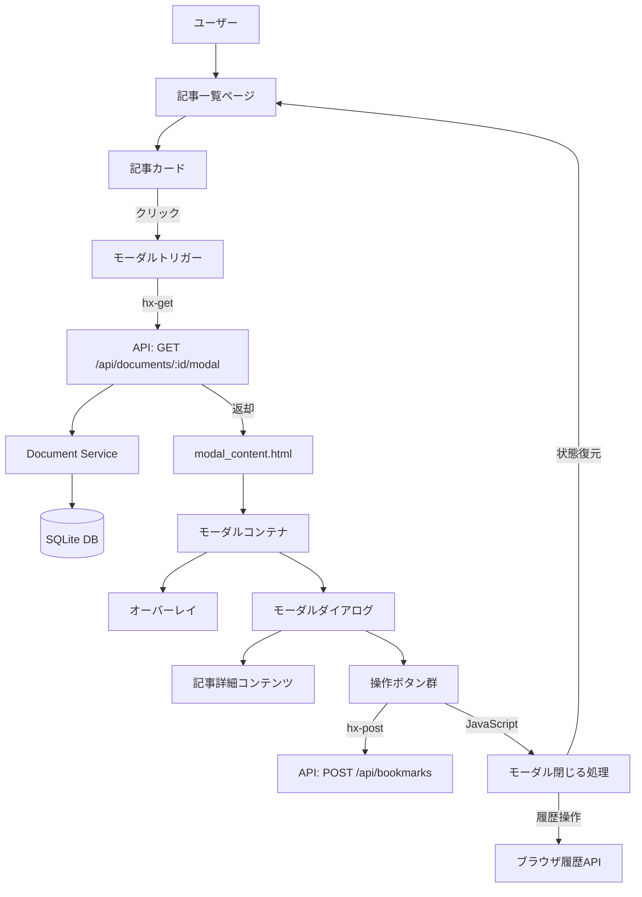
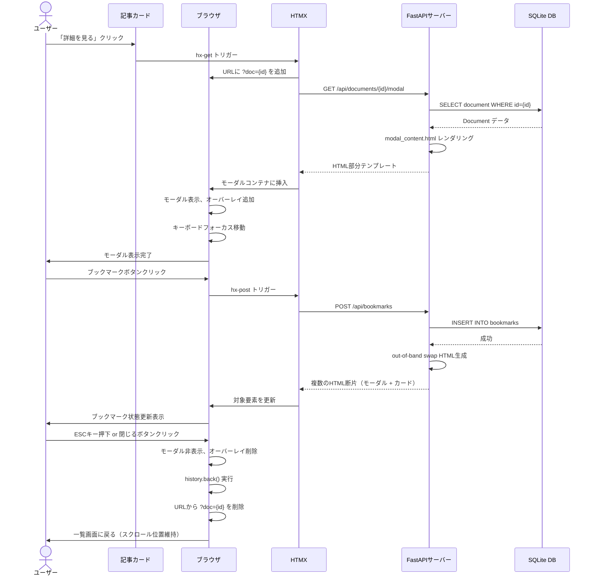
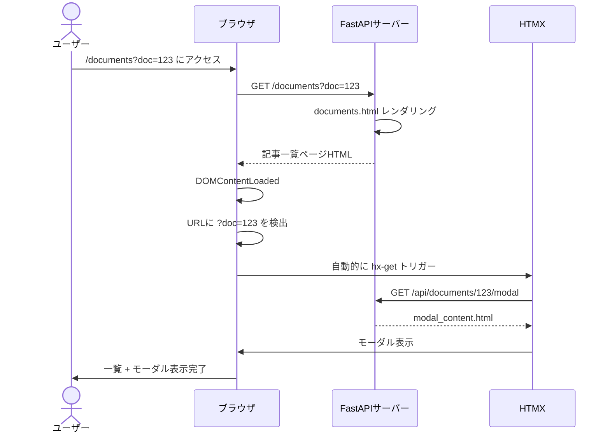

# 技術設計書

## 概要

この機能は、記事詳細表示を別ページ遷移からモーダルポップアップに変更することで、ユーザー体験を大幅に改善します。現在の実装では記事詳細を表示する際にページ遷移が発生し、一覧画面に戻った際にスクロール位置がリセットされる問題があります。モーダル表示により、ユーザーは一覧画面のコンテキスト（スクロール位置、フィルタ状態、検索条件）を維持したまま記事を閲覧でき、複数の記事を効率的に比較・確認できるようになります。

**目的**: この機能は、記事一覧からシームレスに詳細を閲覧できるUIを提供することで、情報収集とコンテンツ管理の効率性を向上させます。

**ユーザー**: 技術者、研究者、情報収集者が、複数の記事を素早く確認したり、興味のある記事をブックマークしたりする際に利用します。

**影響**: 現在の別ページ遷移モデルからモーダル表示モデルに移行します。既存の記事詳細ページ（`/documents/{id}`）は残しつつ、一覧画面からのアクセスパターンをモーダル優先に変更します。

### ゴール
- ユーザーが一覧のスクロール位置を維持したまま記事を閲覧できる
- 複数の記事を効率的に確認できる操作性を実現
- ブックマーク等の操作をモーダル内で完結させる
- アクセシビリティ（キーボード操作、スクリーンリーダー対応）を確保
- デスクトップとモバイルの両方で快適な体験を提供

### 非ゴール
- 記事一覧自体のUI刷新（既存のグリッドレイアウトを維持）
- 記事詳細ページの完全削除（直接アクセスやブックマーク用に残す）
- モーダル内での記事編集機能（将来的な拡張として検討）

## アーキテクチャ

### 既存アーキテクチャ分析

Scrap-Boardは以下のアーキテクチャパターンを採用しています：
- **モノリシックWebアプリケーション**: FastAPI + Jinja2テンプレート
- **HTMX駆動のSPA風UI**: 部分更新でAJAX的な操作を実現
- **サーバーサイドレンダリング**: テンプレートでHTMLを生成
- **レイヤー分離**: API層（routes） → サービス層（services） → データアクセス層（database）

**現在の記事詳細表示フロー**:
```
ユーザー → 記事カード「詳細を見る」クリック
  → ページ遷移: /documents → /documents/{id}
  → サーバー: document_detail() エンドポイント
  → Jinja2: document_detail.html レンダリング
  → ブラウザ: 全ページ再描画（一覧のスクロール位置が失われる）
```

**既存の技術的制約**:
- SQLiteデータベース（ベクトル検索は類似度計算で代替）
- LM Studio/Ollama（ローカルLLM）による要約生成
- グローバルボタンスタイル（`app/static/css/style.css`）による競合
- HTMX minimal版（hx-get, hx-post, hx-target, hx-push-url等の基本機能のみ）

### 高レベルアーキテクチャ

モーダル表示機能は、既存のアーキテクチャパターンを踏襲しつつ、以下のコンポーネントを追加します：



**アーキテクチャ統合**:
- **既存パターン保持**: HTMX + サーバーサイドレンダリング
- **新規コンポーネント追加**: モーダル用HTML部分テンプレート、JavaScript状態管理モジュール、新規APIエンドポイント
- **技術スタック整合性**: FastAPI/Jinja2/HTMX/Tailwind CSSの既存スタックを継続使用
- **Steering原則準拠**: シンプルさ重視、最小JavaScript、プライバシー重視（ローカル実行）

### 技術スタック整合性

この機能は既存の技術スタックに完全に整合します：

**フロントエンド**:
- **HTML/CSS**: Jinja2テンプレート + Tailwind CSS（既存のスタイリングパターンを継承）
- **JavaScript**: Vanilla JS（フレームワーク不要、軽量実装）
- **HTMX**: 既存のminimal版を活用（hx-get, hx-target, hx-push-url）

**バックエンド**:
- **FastAPI**: 新規エンドポイント `/api/documents/{id}/modal` を追加
- **Jinja2**: 部分テンプレート `partials/modal_content.html` を作成
- **SQLAlchemy**: 既存のDocumentモデルとBookmarkリレーションシップを利用

**新規依存関係**: なし（既存のライブラリのみで実装可能）

### 主要な設計決定

#### 決定1: HTMXベースのモーダル実装 vs. JavaScript SPA風実装

**決定**: HTMXベースのモーダル実装を採用

**コンテキスト**: モーダル表示には、以下の2つのアプローチが考えられます：
1. HTMX `hx-get` で部分HTMLを取得し、サーバーサイドレンダリングを活用
2. JavaScriptでAPIからJSONを取得し、クライアント側でHTMLを構築

**代替案**:
- **HTMX + サーバーサイドレンダリング**: 部分テンプレートをサーバーで生成し、HTMX経由で挿入
- **JavaScript + JSON API**: `/api/documents/{id}` からJSONを取得し、JavaScriptでDOM構築
- **Turbolinks/Hotwire Turbo**: 全ページ遷移をインターセプトしてAJAX化（追加ライブラリが必要）

**選択したアプローチ**: HTMX + サーバーサイドレンダリング

**根拠**:
- **既存パターンとの整合性**: プロジェクトは全体的にHTMX + Jinja2を採用しており、同じパターンを踏襲することでコード品質と保守性が向上
- **JavaScriptの最小化**: Steering原則「最小JavaScript」に合致し、フレームワーク不要で軽量
- **SEO/アクセシビリティ**: サーバーサイドレンダリングにより、HTML構造が明確でスクリーンリーダー対応が容易
- **開発効率**: 既存の `document_detail.html` テンプレートを部分テンプレート化することで、重複を避けられる

**トレードオフ**:
- **得られるもの**: コードの一貫性、保守性、アクセシビリティ、軽量実装
- **犠牲にするもの**: クライアント側でのリッチなインタラクション（ただし、必要最小限のJavaScriptで補完可能）

#### 決定2: URL履歴管理とディープリンク対応

**決定**: History API + HTMX `hx-push-url` を組み合わせて、モーダル状態をURL履歴に記録

**コンテキスト**: ユーザーがモーダルを開いた状態をURLで共有したり、ブラウザの戻るボタンでモーダルを閉じたりする標準的なWeb体験を実現する必要があります。

**代替案**:
- **URL履歴に記録しない**: モーダルはJavaScriptで開閉のみ、URL変更なし（共有不可、戻るボタン非対応）
- **クエリパラメータで管理**: `?modal=doc-123` のようなパラメータを追加（HTMXの `hx-push-url` と併用）
- **フラグメント識別子**: `#doc-123` でモーダル状態を管理（SEOに影響せず、軽量）

**選択したアプローチ**: クエリパラメータ `?doc={id}` でモーダル状態を管理

**根拠**:
- **共有可能性**: URLをコピーしてSlackやメールで共有した際に、モーダルが自動的に開く
- **ブラウザ履歴統合**: 戻るボタンでモーダルを閉じる標準的なUI体験
- **HTMX統合**: `hx-push-url="?doc={id}"` で簡単に実装可能
- **SEO中立**: クエリパラメータはページコンテンツに影響せず、検索エンジンは一覧ページとして認識

**トレードオフ**:
- **得られるもの**: 標準的なブラウザ体験、共有機能、戻るボタン対応
- **犠牲にするもの**: わずかな実装複雑性（JavaScriptでのpopstateイベント処理が必要）

#### 決定3: モーダル内でのブックマーク状態同期

**決定**: HTMXの `hx-swap` と `out-of-band` スワップを使用して、モーダル内と一覧画面の両方のブックマーク状態を同期

**コンテキスト**: ユーザーがモーダル内で記事をブックマークした際、モーダル内のUIと背景の記事カードの両方を更新する必要があります。

**代替案**:
- **モーダル内のみ更新**: 一覧に戻った際にページ全体をリロード（UX劣化）
- **JavaScript + DOM操作**: ブックマークボタンのクリックイベントをフックし、手動でDOMを更新
- **HTMX out-of-band swap**: サーバーが複数のHTML断片を返却し、HTMXが自動的に対応する要素を更新

**選択したアプローチ**: HTMX out-of-band swap

**根拠**:
- **HTMXネイティブ機能**: 追加のJavaScriptなしで複数箇所の更新が可能
- **一貫性**: サーバーが信頼できる情報源（Single Source of Truth）として、ブックマーク状態を管理
- **シンプルさ**: DOMの手動操作が不要で、バグの可能性が低い

**実装例**:
```html
<!-- サーバーが返却するHTML -->
<div id="modal-bookmark-btn" hx-swap-oob="true">
  <!-- 更新されたモーダル内のブックマークボタン -->
</div>
<div id="card-{doc_id}-bookmark" hx-swap-oob="true">
  <!-- 更新された記事カードのブックマーク表示 -->
</div>
```

**トレードオフ**:
- **得られるもの**: シンプルな実装、サーバー主導の状態管理、バグの少なさ
- **犠牲にするもの**: わずかなHTMLサイズ増加（複数のHTML断片を返却するため）

## システムフロー

### ユーザーインタラクションフロー

以下のシーケンス図は、ユーザーが記事詳細モーダルを開き、ブックマーク操作を行い、モーダルを閉じるまでの全体的な流れを示しています。



### ディープリンク対応フロー

ユーザーが直接 `/documents?doc={id}` のURLにアクセスした際の処理フローを示します。



## 要件トレーサビリティ

| 要件ID | 要件概要 | 実現コンポーネント | インターフェース | フロー参照 |
|--------|----------|-------------------|--------------|----------|
| 1.1 | 記事カードクリックでモーダル表示 | ModalTrigger (document_card.html) | hx-get, hx-target | ユーザーインタラクション |
| 1.2 | 背景の記事一覧を維持 | ModalOverlay (CSS) | z-index レイヤリング | - |
| 1.3 | 背景にオーバーレイ表示 | ModalOverlay (CSS) | 半透明黒背景 | - |
| 1.4 | スクロール位置保持 | JavaScript (modal.js) | body overflow制御 | - |
| 2.1-2.3 | 閉じる操作（×ボタン、背景クリック、ESCキー） | ModalCloseHandler (modal.js) | イベントリスナー | ユーザーインタラクション |
| 2.4 | スクロール位置復元 | JavaScript (modal.js) | 状態管理 | - |
| 3.1-3.5 | モーダル内の詳細表示（タイトル、本文、メタデータ等） | ModalContent (modal_content.html) | Jinja2 テンプレート | - |
| 4.1-4.4 | ブックマーク操作とUI更新 | BookmarkButton, BookmarkAPI | hx-post, out-of-band swap | ユーザーインタラクション |
| 5.1-5.4 | レスポンシブデザイン | ModalDialog (CSS) | Tailwind レスポンシブクラス | - |
| 6.1-6.4 | URL管理とブラウザ履歴 | HistoryManager (modal.js) | History API, popstate | ディープリンク対応 |
| 7.1-7.5 | パフォーマンスとアクセシビリティ | 全コンポーネント | ARIA属性、フォーカス管理 | - |

## コンポーネントとインターフェース

### UI層（フロントエンド）

#### モーダルトリガー（記事カード拡張）

**責務と境界**
- **主要責務**: 記事カード内の「詳細を見る」ボタンにモーダル起動のHTMX属性を追加
- **ドメイン境界**: UI層（プレゼンテーション）
- **データ所有権**: なし（既存の記事データを表示するのみ）
- **トランザクション境界**: なし（読み取り専用のUI要素）

**依存関係**
- **インバウンド**: なし（ユーザーアクションが起点）
- **アウトバウンド**: HTMX（モーダルコンテンツ取得API `/api/documents/{id}/modal` を呼び出し）
- **外部**: なし

**契約定義 - HTML/HTMX契約**

```html
<!-- partials/document_card.html の拡張 -->
<a
  href="/documents/{{ document.id }}"
  class="text-xs bg-emerald text-white px-3 py-1 rounded-md hover:bg-emerald/90 ml-2"
  hx-get="/api/documents/{{ document.id }}/modal"
  hx-target="#modal-container"
  hx-push-url="/documents?doc={{ document.id }}"
  hx-swap="innerHTML"
  onclick="event.preventDefault()"
>
  詳細を見る
</a>

<!-- モーダルコンテナ（base.html または documents.html に追加） -->
<div id="modal-container" class="hidden" role="dialog" aria-modal="true"></div>
```

**挙動**:
- **前提条件**: `document.id` が有効な記事IDであること
- **後続条件**: HTMX経由でサーバーにリクエストが送信され、モーダルコンテナにHTMLが挿入される
- **不変条件**: ページ全体の再読み込みは発生しない（`onclick="event.preventDefault()"` で防止）

#### モーダルコンテナ（ベーステンプレート拡張）

**責務と境界**
- **主要責務**: モーダルのルートDOMノードを提供し、HTMXターゲットとして機能
- **ドメイン境界**: UI層（構造）
- **データ所有権**: なし
- **トランザクション境界**: なし

**依存関係**
- **インバウンド**: HTMX（モーダルコンテンツを受信）
- **アウトバウンド**: なし
- **外部**: なし

**契約定義 - HTML構造**

```html
<!-- app/templates/base.html または documents.html に追加 -->
<div
  id="modal-container"
  class="hidden fixed inset-0 z-50 overflow-auto bg-black/40"
  role="dialog"
  aria-modal="true"
  aria-labelledby="modal-title"
  data-modal-container
>
  <!-- モーダルコンテンツがHTMXによってここに挿入される -->
</div>
```

**状態管理**
- **状態モデル**: `hidden` クラスの有無でモーダルの表示/非表示を切り替え
- **永続化**: なし（セッション内の一時的な状態）
- **並行性**: なし（単一のモーダルのみ表示）

#### モーダルコンテンツ（部分テンプレート）

**責務と境界**
- **主要責務**: 記事詳細情報をモーダル内に表示する部分テンプレート
- **ドメイン境界**: UI層（プレゼンテーション）
- **データ所有権**: なし（サーバーから受信したDocumentデータを表示）
- **トランザクション境界**: なし（読み取り専用）

**依存関係**
- **インバウンド**: FastAPI（モーダル用エンドポイント `/api/documents/{id}/modal`）
- **アウトバウンド**:
  - BookmarkAPI（ブックマーク操作）
  - SummaryAPI（要約生成）
  - SimilarDocumentsAPI（類似記事取得）
- **外部**: なし

**契約定義 - テンプレート構造**

```html
<!-- app/templates/partials/modal_content.html -->
<div class="relative bg-white rounded-lg max-w-4xl mx-auto my-8" data-modal-dialog>
  <!-- ヘッダー: タイトルと閉じるボタン -->
  <div class="flex items-start justify-between p-6 border-b">
    <h2 id="modal-title" class="text-2xl font-bold">{{ document.title }}</h2>
    <button
      class="text-gray-400 hover:text-gray-600"
      aria-label="閉じる"
      data-modal-close
    >
      <i data-lucide="x" class="w-6 h-6"></i>
    </button>
  </div>

  <!-- コンテンツ: 本文、メタデータ -->
  <div class="p-6 max-h-[70vh] overflow-y-auto">
    <!-- 既存の document_detail.html から再利用 -->
    

    <!-- 記事本文 -->
    <div class="prose max-w-none">
      {{ document.content_md | markdown | safe }}
    </div>

    <!-- 類似記事（HTMX lazy loading） -->
    <div
      hx-get="/api/documents/{{ document.id }}/similar"
      hx-trigger="load"
      hx-target="#similar-documents"
    >
      <div id="similar-documents"></div>
    </div>
  </div>

  <!-- フッター: アクション -->
  <div class="flex items-center justify-between p-6 border-t">
    <div class="flex gap-3">
      <!-- ブックマークボタン -->
      <button
        id="modal-bookmark-btn"
        class="btn-secondary"
        hx-post="/api/bookmarks"
        hx-vals='{"document_id": "{{ document.id }}"}'
        hx-swap="outerHTML"
        hx-target="#modal-bookmark-btn"
      >
        <i data-lucide="heart" class="w-5 h-5"></i>
        ブックマーク
      </button>

      <!-- 元記事リンク -->
      <a href="{{ document.url }}" target="_blank" class="btn-secondary">
        <i data-lucide="external-link" class="w-5 h-5"></i>
        元記事を見る
      </a>
    </div>

    <button class="btn-primary" data-modal-close>閉じる</button>
  </div>
</div>
```

**統合戦略（既存システムとの統合）**
- **修正アプローチ**: 既存の `document_detail.html` から部分テンプレート `partials/_document_meta.html` を切り出し、再利用
- **後方互換性**: 既存の `/documents/{id}` エンドポイントは維持（直接アクセスやブックマーク用）
- **移行パス**: 段階的に移行
  1. モーダル用エンドポイントと部分テンプレートを追加
  2. 記事カードのリンクをHTMX対応に変更
  3. 既存の詳細ページは残しつつ、一覧からのアクセスをモーダル優先に

#### モーダル操作JavaScript（状態管理モジュール）

**責務と境界**
- **主要責務**: モーダルの開閉、キーボードイベント処理、URL履歴管理、フォーカス管理
- **ドメイン境界**: UI層（インタラクション）
- **データ所有権**: モーダルの表示状態、前回のフォーカス位置
- **トランザクション境界**: なし

**依存関係**
- **インバウンド**: ユーザーイベント（クリック、ESCキー、popstate）
- **アウトバウンド**: DOM API（要素の表示/非表示、フォーカス移動）、History API（pushState, popstate）
- **外部**: なし

**契約定義 - JavaScriptモジュール**

```typescript
// app/static/js/modal.js

interface ModalManager {
  /**
   * モーダルを開く
   * @param documentId - 記事ID
   * @precondition モーダルコンテナが存在すること
   * @postcondition モーダルが表示され、URL履歴が追加される
   */
  openModal(documentId: string): void;

  /**
   * モーダルを閉じる
   * @precondition モーダルが開いていること
   * @postcondition モーダルが非表示になり、フォーカスが元の位置に戻る
   */
  closeModal(): void;

  /**
   * ESCキーでモーダルを閉じる
   * @precondition モーダルが開いていること
   */
  handleEscapeKey(event: KeyboardEvent): void;

  /**
   * ブラウザの戻るボタンでモーダルを閉じる
   * @precondition URL履歴にモーダル状態が記録されていること
   */
  handlePopState(event: PopStateEvent): void;
}
```

**実装例**:

```javascript
// app/static/js/modal.js
(function() {
  const modalContainer = document.getElementById('modal-container');
  let lastFocusedElement = null;

  // モーダルを開く
  function openModal() {
    if (!modalContainer) return;

    lastFocusedElement = document.activeElement;
    modalContainer.classList.remove('hidden');
    document.body.style.overflow = 'hidden'; // 背景スクロール防止

    // フォーカスをモーダル内に移動
    const firstFocusable = modalContainer.querySelector('button, a, [tabindex]');
    if (firstFocusable) firstFocusable.focus();
  }

  // モーダルを閉じる
  function closeModal() {
    if (!modalContainer) return;

    modalContainer.classList.add('hidden');
    document.body.style.overflow = ''; // スクロール復元

    // フォーカスを元の位置に戻す
    if (lastFocusedElement) {
      lastFocusedElement.focus();
      lastFocusedElement = null;
    }

    // URL履歴を戻す（?doc={id} を削除）
    const url = new URL(window.location);
    url.searchParams.delete('doc');
    window.history.pushState({}, '', url);
  }

  // ESCキーでモーダルを閉じる
  document.addEventListener('keydown', function(e) {
    if (e.key === 'Escape' && !modalContainer.classList.contains('hidden')) {
      closeModal();
    }
  });

  // 閉じるボタンと背景クリックのイベント
  document.addEventListener('click', function(e) {
    if (e.target.matches('[data-modal-close]')) {
      closeModal();
    }
    if (e.target === modalContainer) {
      closeModal();
    }
  });

  // ブラウザの戻るボタン
  window.addEventListener('popstate', function(e) {
    const url = new URL(window.location);
    if (!url.searchParams.has('doc')) {
      closeModal();
    }
  });

  // HTMX afterSwap イベントでモーダルを開く
  document.addEventListener('htmx:afterSwap', function(e) {
    if (e.detail.target.id === 'modal-container') {
      openModal();
    }
  });

  // ページロード時に ?doc={id} があれば自動的にモーダルを開く
  document.addEventListener('DOMContentLoaded', function() {
    const url = new URL(window.location);
    const docId = url.searchParams.get('doc');
    if (docId && modalContainer) {
      // HTMXでモーダルコンテンツを取得
      htmx.ajax('GET', `/api/documents/${docId}/modal`, {
        target: '#modal-container',
        swap: 'innerHTML'
      });
    }
  });
})();
```

**状態管理**:
- **状態モデル**: モーダルの開閉状態、前回のフォーカス位置
- **永続化**: URL履歴（クエリパラメータ `?doc={id}`）
- **並行性**: なし（単一のモーダルのみ）

### API層（バックエンド）

#### モーダルコンテンツ取得エンドポイント

**責務と境界**
- **主要責務**: 記事詳細データを取得し、モーダル用の部分テンプレートをレンダリング
- **ドメイン境界**: API層（HTTPエンドポイント）
- **データ所有権**: なし（データベースから取得したDocumentデータを変換するのみ）
- **トランザクション境界**: 単一の読み取りトランザクション

**依存関係**
- **インバウンド**: HTMX（記事カードからのGETリクエスト）
- **アウトバウンド**:
  - DocumentRepository（データ取得）
  - Jinja2Templates（HTMLレンダリング）
- **外部**: なし

**契約定義 - REST API**

| Method | Endpoint | Request | Response | Errors |
|--------|----------|---------|----------|--------|
| GET | `/api/documents/{id}/modal` | Path: `id` (str) | HTML Fragment (200) | 404 (Document not found) |

**詳細スキーマ**:

```python
# app/api/routes/documents.py

@router.get("/{document_id}/modal", response_class=HTMLResponse)
async def get_document_modal(
    request: Request,
    document_id: str,
    db: Session = Depends(get_db)
):
    """
    記事詳細のモーダル用HTML部分テンプレートを返却

    Args:
        request: FastAPIのRequestオブジェクト
        document_id: 記事ID
        db: データベースセッション

    Returns:
        HTMLResponse: modal_content.html の部分テンプレート

    Raises:
        HTTPException(404): 記事が存在しない場合
    """
    document = db.query(Document).filter(Document.id == document_id).first()
    if not document:
        raise HTTPException(status_code=404, detail="Document not found")

    # ブックマーク状態を付与（既存のロジックを再利用）
    try:
        document.bookmarked = bool(document.bookmarks and len(document.bookmarks) > 0)
    except Exception:
        document.bookmarked = False

    return templates.TemplateResponse(
        "partials/modal_content.html",
        {
            "request": request,
            "document": document
        }
    )
```

**前提条件**:
- `document_id` が有効なUUID形式であること
- データベースが利用可能であること

**後続条件**:
- 成功時: 記事詳細のHTML部分テンプレートが返却される
- 失敗時: 404エラーが返却される

**不変条件**:
- データベースの状態は変更されない（読み取り専用）

#### ブックマークAPI拡張（Out-of-Band Swap対応）

**責務と境界**
- **主要責務**: ブックマークの追加/削除を処理し、モーダル内とカード内の両方のUIを更新
- **ドメイン境界**: API層（HTTPエンドポイント）
- **データ所有権**: Bookmarkエンティティの作成/削除
- **トランザクション境界**: 単一の書き込みトランザクション（INSERT/DELETE）

**依存関係**
- **インバウンド**: HTMX（モーダル内のブックマークボタン）
- **アウトバウンド**:
  - BookmarkRepository（データ永続化）
  - Jinja2Templates（複数のHTML断片をレンダリング）
- **外部**: なし

**契約定義 - REST API（拡張）**

| Method | Endpoint | Request | Response | Errors |
|--------|----------|---------|----------|--------|
| POST | `/api/bookmarks` | JSON: `{document_id: str}` | HTML Fragments (200) or JSON (200) | 404 (Document not found) |
| DELETE | `/api/bookmarks` | Query: `document_id` (str) | HTML Fragments (200) or JSON (200) | 404 (Bookmark not found) |

**詳細スキーマ（拡張部分）**:

```python
# app/api/routes/bookmarks.py

@router.post("", response_class=HTMLResponse)
async def create_bookmark(
    request: Request,
    document_id: str = Body(..., embed=True),
    db: Session = Depends(get_db)
):
    """
    ブックマークを追加し、モーダルとカードの両方のUIを更新

    Args:
        request: FastAPIのRequestオブジェクト
        document_id: 記事ID
        db: データベースセッション

    Returns:
        HTMLResponse: 複数のHTML断片（out-of-band swap用）
        JSONResponse: HTMX以外のリクエストの場合
    """
    # 既存のブックマーク追加ロジック
    bookmark = Bookmark(document_id=document_id, user_id="guest")
    db.add(bookmark)
    db.commit()

    # HTMX リクエストの場合は複数のHTML断片を返却
    if request.headers.get("HX-Request"):
        modal_btn = templates.get_template("partials/bookmark_button.html").render(
            document_id=document_id,
            bookmarked=True,
            context="modal"
        )
        card_badge = templates.get_template("partials/bookmark_badge.html").render(
            document_id=document_id,
            bookmarked=True
        )

        html = f"""
        <button id="modal-bookmark-btn" hx-swap-oob="true" ...>
          {modal_btn}
        </button>
        <div id="card-{document_id}-bookmark" hx-swap-oob="true">
          {card_badge}
        </div>
        """
        return HTMLResponse(html)

    # 通常のAPIリクエストの場合はJSONを返却
    return {"status": "success", "bookmarked": True}
```

**統合戦略**:
- **修正アプローチ**: 既存の `/api/bookmarks` エンドポイントを拡張し、HTMX `HX-Request` ヘッダーの有無で応答形式を切り替え
- **後方互換性**: HTMX以外のクライアント（APIテスト、将来的なモバイルアプリ等）はJSON応答を受信
- **移行パス**: 既存のブックマーク機能を壊さず、段階的に拡張

## データモデル

この機能は新しいデータモデルを導入しません。既存の `Document` および `Bookmark` モデルをそのまま利用します。

### 既存モデルの利用

**Document エンティティ**（`app/core/database.py`）:
```python
class Document(Base):
    __tablename__ = "documents"

    id = Column(String, primary_key=True)
    title = Column(String, nullable=False)
    url = Column(String)
    domain = Column(String)
    content_md = Column(Text)
    content_text = Column(Text)
    short_summary = Column(Text)
    thumbnail_url = Column(String)
    # ... その他のフィールド

    # リレーションシップ
    classifications = relationship("Classification", back_populates="document")
    bookmarks = relationship("Bookmark", back_populates="document")
```

**Bookmark エンティティ**（`app/core/database.py`）:
```python
class Bookmark(Base):
    __tablename__ = "bookmarks"

    id = Column(Integer, primary_key=True, autoincrement=True)
    document_id = Column(String, ForeignKey("documents.id"), nullable=False)
    user_id = Column(String, nullable=False, default="guest")
    created_at = Column(DateTime, default=datetime.utcnow)
    note = Column(Text)

    # リレーションシップ
    document = relationship("Document", back_populates="bookmarks")
```

**データ整合性**:
- **外部キー制約**: `bookmarks.document_id` → `documents.id`
- **カスケード削除**: 記事が削除された際、関連するブックマークも削除される（既存の挙動を維持）

## エラーハンドリング

### エラー戦略

モーダル機能におけるエラーは、以下の3つのカテゴリに分類されます：

1. **ユーザーエラー（4xx）**: 無効なリクエスト
2. **システムエラー（5xx）**: サーバー側の障害
3. **UI状態エラー**: JavaScript実行時の予期しない状態

### エラーカテゴリと応答

#### ユーザーエラー（4xx）

**404 - Document not found**:
- **発生条件**: 存在しない記事IDでモーダルを開こうとした
- **応答**: エラーメッセージをモーダル内に表示
  ```html
  <div class="p-6 text-center">
    <i data-lucide="alert-circle" class="w-12 h-12 text-red-500 mx-auto"></i>
    <p class="mt-4 text-lg text-gray-700">記事が見つかりませんでした</p>
    <button class="btn-primary mt-4" data-modal-close>閉じる</button>
  </div>
  ```

**403 - Access denied**:
- **発生条件**: （将来的なマルチユーザー対応時）アクセス権限がない記事を開こうとした
- **応答**: 権限エラーメッセージを表示

#### システムエラー（5xx）

**500 - Internal Server Error**:
- **発生条件**: データベース接続エラー、テンプレートレンダリングエラー
- **応答**: 汎用エラーメッセージをモーダル内に表示
  ```html
  <div class="p-6 text-center">
    <i data-lucide="alert-triangle" class="w-12 h-12 text-yellow-500 mx-auto"></i>
    <p class="mt-4 text-lg text-gray-700">一時的なエラーが発生しました</p>
    <p class="text-sm text-gray-500">しばらくしてから再度お試しください</p>
    <button class="btn-primary mt-4" data-modal-close>閉じる</button>
  </div>
  ```

**503 - Service Unavailable**:
- **発生条件**: LLMサービス（要約生成）が利用不可
- **応答**: 要約セクションにフォールバックメッセージを表示（モーダル自体は表示）

#### UI状態エラー

**モーダルコンテナが存在しない**:
- **発生条件**: DOM構造が破損している、テンプレートのレンダリングエラー
- **応答**: コンソールエラーログを出力し、従来の詳細ページへフォールバック
  ```javascript
  if (!modalContainer) {
    console.error('Modal container not found. Falling back to traditional page navigation.');
    window.location.href = `/documents/${documentId}`;
    return;
  }
  ```

**HTMX リクエスト失敗**:
- **発生条件**: ネットワークエラー、タイムアウト
- **応答**: HTMX `htmx:responseError` イベントをリッスンし、エラートーストを表示
  ```javascript
  document.addEventListener('htmx:responseError', function(e) {
    showNotification('記事の読み込みに失敗しました', 'error');
    closeModal();
  });
  ```

### モニタリング

**エラートラッキング**:
- FastAPI の標準ロギング（`logging.error()`）でサーバー側エラーを記録
- ブラウザのコンソールログでクライアント側エラーを記録
- 将来的にSentry等のエラートラッキングサービスを統合可能

**ヘルスモニタリング**:
- 既存の `/health` エンドポイントを活用
- モーダル機能に特化した追加のメトリクスは不要（軽量な機能のため）

## テスト戦略

### ユニットテスト（Pythonバックエンド）

**対象**: モーダル用APIエンドポイント

**テストケース（3-5項目）**:
1. **正常系: 記事詳細の取得**: 有効な記事IDでモーダルコンテンツが返却される
2. **異常系: 存在しない記事ID**: 404エラーが返却される
3. **正常系: ブックマーク追加のout-of-band swap**: HTMX リクエストで複数のHTML断片が返却される
4. **正常系: ブックマーク削除**: 既存のブックマークが削除され、UI更新用のHTMLが返却される
5. **エッジケース: ブックマーク重複追加**: 同じ記事に対するブックマークが重複しない

**実装例**:
```python
# tests/test_modal_api.py

def test_get_document_modal_success(client, db_with_document):
    """正常系: モーダルコンテンツの取得"""
    doc_id = "test-doc-123"
    response = client.get(f"/api/documents/{doc_id}/modal")
    assert response.status_code == 200
    assert "text/html" in response.headers["content-type"]
    assert doc_id in response.text

def test_get_document_modal_not_found(client, db):
    """異常系: 存在しない記事ID"""
    response = client.get("/api/documents/nonexistent/modal")
    assert response.status_code == 404

def test_bookmark_oob_swap(client, db_with_document):
    """正常系: ブックマーク追加時のout-of-band swap"""
    doc_id = "test-doc-123"
    response = client.post(
        "/api/bookmarks",
        json={"document_id": doc_id},
        headers={"HX-Request": "true"}
    )
    assert response.status_code == 200
    assert "hx-swap-oob" in response.text
    assert "modal-bookmark-btn" in response.text
    assert f"card-{doc_id}-bookmark" in response.text
```

### 統合テスト（Playwright E2E）

**対象**: モーダルのUI操作フロー

**テストケース（3-5項目）**:
1. **正常系: 記事カードからモーダルを開く**: クリックでモーダルが表示され、背景がオーバーレイされる
2. **正常系: モーダル内でブックマーク操作**: ブックマークボタンをクリックし、モーダルとカードの両方が更新される
3. **正常系: モーダルを閉じる操作**: ×ボタン、背景クリック、ESCキーでモーダルが閉じられる
4. **正常系: ディープリンク対応**: `/documents?doc=123` にアクセスしてモーダルが自動的に開く
5. **正常系: ブラウザの戻るボタン**: 戻るボタンでモーダルが閉じられ、一覧画面に戻る

**実装例**:
```python
# tests/test_modal_ui.py

import pytest
from playwright.sync_api import Page, expect

def test_open_modal_from_card(page: Page, live_server):
    """正常系: 記事カードからモーダルを開く"""
    page.goto(f"{live_server}/documents")

    # 記事カードの「詳細を見る」をクリック
    page.click("a:has-text('詳細を見る')")

    # モーダルが表示される
    modal = page.locator("#modal-container")
    expect(modal).not_to_have_class("hidden")

    # オーバーレイが表示される
    expect(modal).to_have_css("background-color", "rgba(0, 0, 0, 0.4)")

    # URLに ?doc={id} が追加される
    expect(page).to_have_url(re.compile(r"\?doc="))

def test_bookmark_in_modal(page: Page, live_server):
    """正常系: モーダル内でブックマーク操作"""
    page.goto(f"{live_server}/documents")
    page.click("a:has-text('詳細を見る')")

    # ブックマークボタンをクリック
    page.click("#modal-bookmark-btn")

    # モーダル内のボタンが更新される
    expect(page.locator("#modal-bookmark-btn")).to_have_attribute("aria-pressed", "true")

    # 背景の記事カードも更新される
    doc_id = page.url.split("doc=")[1]
    expect(page.locator(f"#card-{doc_id}-bookmark")).to_contain_text("ブックマーク済み")

def test_close_modal_with_escape(page: Page, live_server):
    """正常系: ESCキーでモーダルを閉じる"""
    page.goto(f"{live_server}/documents")
    page.click("a:has-text('詳細を見る')")

    # ESCキーを押下
    page.keyboard.press("Escape")

    # モーダルが非表示になる
    modal = page.locator("#modal-container")
    expect(modal).to_have_class("hidden")

    # URLから ?doc={id} が削除される
    expect(page).not_to_have_url(re.compile(r"\?doc="))
```

### パフォーマンステスト

**対象**: モーダル表示速度

**テストケース（2-3項目）**:
1. **正常系: モーダル表示速度**: 記事カードクリックから500ms以内にモーダルが表示される
2. **正常系: ブックマーク操作の応答性**: ブックマークボタンクリックから200ms以内にUI更新が完了する

**実装例**:
```python
def test_modal_display_performance(page: Page, live_server):
    """正常系: モーダル表示速度が500ms以内"""
    page.goto(f"{live_server}/documents")

    start_time = time.time()
    page.click("a:has-text('詳細を見る')")

    # モーダルが表示されるまでの時間を測定
    modal = page.locator("#modal-container")
    expect(modal).not_to_have_class("hidden")
    elapsed_time = (time.time() - start_time) * 1000

    assert elapsed_time < 500, f"Modal took {elapsed_time}ms to display (expected <500ms)"
```

## セキュリティ考慮事項

### XSS（クロスサイトスクリプティング）対策

**リスク**: ユーザーが提供したコンテンツ（記事タイトル、本文）がそのままHTMLに挿入される場合、悪意のあるスクリプトが実行される可能性があります。

**対策**:
- **Jinja2のautoescapeを有効化**: すべてのテンプレートで `{{ variable }}` は自動的にHTMLエスケープされます
- **`| safe` フィルタの慎重な使用**: Markdownレンダリング後のHTMLに `| safe` を使用する場合は、事前にサニタイズを実施
- **CSP（Content Security Policy）ヘッダー**: 将来的にインラインスクリプトの実行を制限

**実装例**:
```python
# app/main.py

from fastapi.middleware.trustedhost import TrustedHostMiddleware
from starlette.middleware.httpsredirect import HTTPSRedirectMiddleware

# 本番環境ではHTTPS強制
if settings.environment == "production":
    app.add_middleware(HTTPSRedirectMiddleware)

# CSPヘッダーの追加（将来的な対応）
@app.middleware("http")
async def add_security_headers(request: Request, call_next):
    response = await call_next(request)
    response.headers["Content-Security-Policy"] = (
        "default-src 'self'; "
        "script-src 'self' 'unsafe-inline' https://cdn.jsdelivr.net; "
        "style-src 'self' 'unsafe-inline'; "
    )
    return response
```

### CSRF（クロスサイトリクエストフォージェリ）対策

**リスク**: 悪意のあるサイトから、ユーザーが認証済みの状態でブックマーク追加/削除のリクエストが送信される可能性があります。

**対策**:
- **CSRFトークンの導入**: FastAPIの標準ミドルウェア `fastapi-csrf` を使用
- **同一オリジンポリシー**: ブラウザの標準保護機能により、異なるオリジンからのHTMX リクエストはブロックされます

**実装例**（将来的な拡張）:
```python
# app/main.py

from fastapi_csrf import CsrfProtect

csrf_protect = CsrfProtect(secret_key=settings.secret_key)
app.add_middleware(csrf_protect)
```

### 認証と認可

**現状**: 単一ユーザー前提で認証機能なし（`user_id="guest"` をデフォルト使用）

**将来的な対応**:
- マルチユーザー対応時に認証機能（JWT、OAuth2等）を追加
- 記事の公開/非公開フラグを導入し、アクセス制御を実施

## パフォーマンスと拡張性

### ターゲットメトリクス

| メトリクス | 目標値 | 測定方法 |
|-----------|--------|---------|
| モーダル表示速度 | <500ms | Playwright performance測定 |
| ブックマーク操作応答 | <200ms | HTMX swap完了までの時間 |
| モーダルコンテンツサイズ | <50KB | ネットワークタブでHTMLサイズ確認 |

### スケーリングアプローチ

**水平スケーリング（将来的な対応）**:
- FastAPIアプリケーションの複数インスタンス起動
- ロードバランサー（nginx、Traefik等）による分散

**垂直スケーリング**:
- SQLiteの制約により、大規模データセット（10万件以上の記事）ではPostgreSQLへの移行を検討
- モーダルコンテンツのキャッシュ（Redis等）を導入

### キャッシング戦略

**ブラウザキャッシュ**:
- 静的アセット（CSS、JS）には `Cache-Control` ヘッダーを設定
- モーダルコンテンツ（HTML）は動的なため、キャッシュしない

**サーバーサイドキャッシュ（将来的な対応）**:
- 要約生成結果を `document.short_summary` に永続化（既存の挙動）
- 類似記事リストをRedisにキャッシュ（TTL: 1時間）

### 最適化技術

**遅延読み込み**:
- 類似記事セクションをHTMX `hx-trigger="load"` で遅延読み込み
- 画像サムネイルを `loading="lazy"` で遅延読み込み

**HTML圧縮**:
- Jinja2テンプレートの空白を削除（`trim_blocks=True`, `lstrip_blocks=True`）
- 本番環境でgzip圧縮を有効化

## 移行戦略

### フェーズ1: 基盤構築（1-2日）

**目標**: モーダルの基本的な表示機能を実装

**タスク**:
1. モーダルコンテナをベーステンプレートに追加
2. 部分テンプレート `partials/modal_content.html` を作成（既存の `document_detail.html` から抽出）
3. 新規APIエンドポイント `/api/documents/{id}/modal` を実装
4. JavaScript モジュール `modal.js` を作成（開閉、ESCキー、背景クリック）

**検証基準**:
- 記事カードから「詳細を見る」をクリックしてモーダルが表示される
- ×ボタン、背景クリック、ESCキーでモーダルが閉じられる

### フェーズ2: 機能拡張（2-3日）

**目標**: URL履歴管理、ブックマーク操作、ディープリンク対応

**タスク**:
1. HTMX `hx-push-url` でURL履歴を管理
2. JavaScript `popstate` イベントでブラウザの戻るボタン対応
3. ブックマークAPIにout-of-band swap機能を追加
4. ディープリンク対応（ページロード時に `?doc={id}` を検出して自動的にモーダルを開く）

**検証基準**:
- URLに `?doc={id}` が追加され、戻るボタンでモーダルが閉じられる
- モーダル内のブックマーク操作で、モーダルとカードの両方が更新される
- `/documents?doc=123` に直接アクセスしてモーダルが開く

### フェーズ3: テストとアクセシビリティ（1-2日）

**目標**: ユニットテスト、E2Eテスト、アクセシビリティ対応

**タスク**:
1. Pytestでモーダル用APIエンドポイントのユニットテストを作成
2. PlaywrightでモーダルUIのE2Eテストを作成
3. ARIA属性（`role="dialog"`, `aria-modal="true"`, `aria-labelledby`）を追加
4. キーボードフォーカス管理（フォーカストラップ、元の位置へのフォーカス復元）

**検証基準**:
- 全テストがパスする
- スクリーンリーダーでモーダルの内容が読み上げられる
- キーボード操作のみでモーダルを開閉し、内容を閲覧できる

### ロールバック戦略

**ロールバック トリガー**:
- モーダル機能に重大なバグが発見された場合（例: ブックマーク同期の失敗、モーダルが閉じられない等）
- パフォーマンスが著しく低下した場合（モーダル表示に1秒以上かかる等）

**ロールバック手順**:
1. 記事カードの「詳細を見る」リンクからHTMX属性を削除し、通常の `href="/documents/{id}"` に戻す
2. モーダルコンテナをベーステンプレートから削除
3. `modal.js` の読み込みを無効化
4. 既存の `/documents/{id}` エンドポイントはそのまま残っているため、即座に元の詳細ページに戻る

**データバックアップ**:
- SQLiteデータベースの自動バックアップを有効化（既存の運用）
- モーダル機能自体はデータ構造を変更しないため、追加のバックアップは不要
