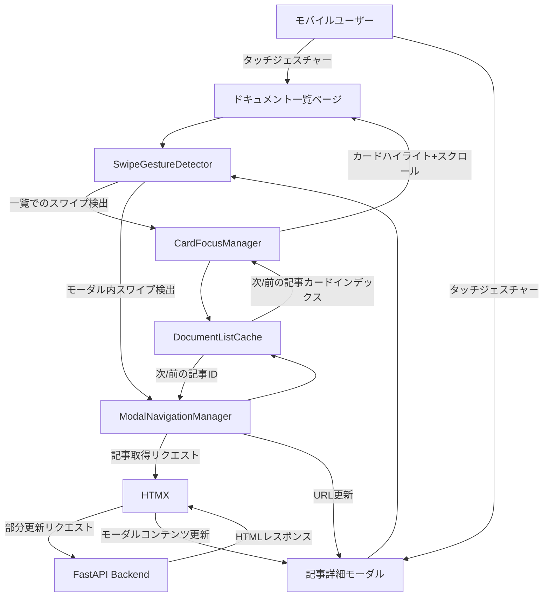
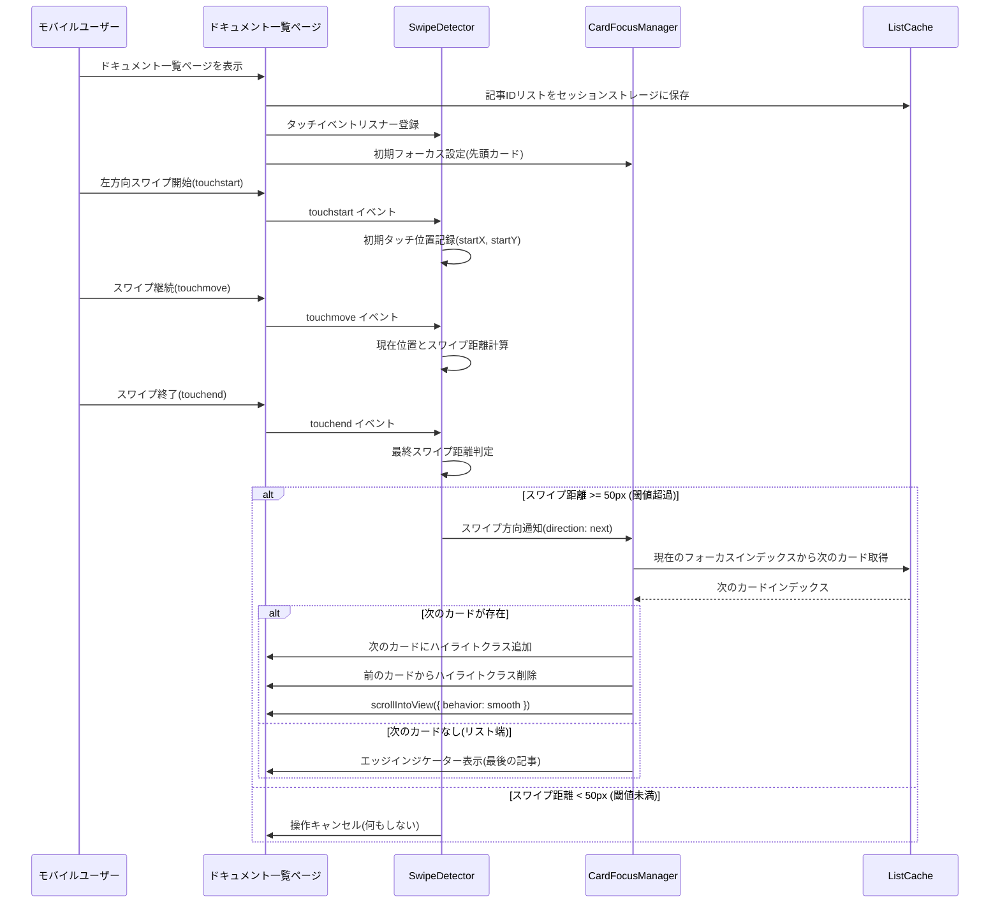
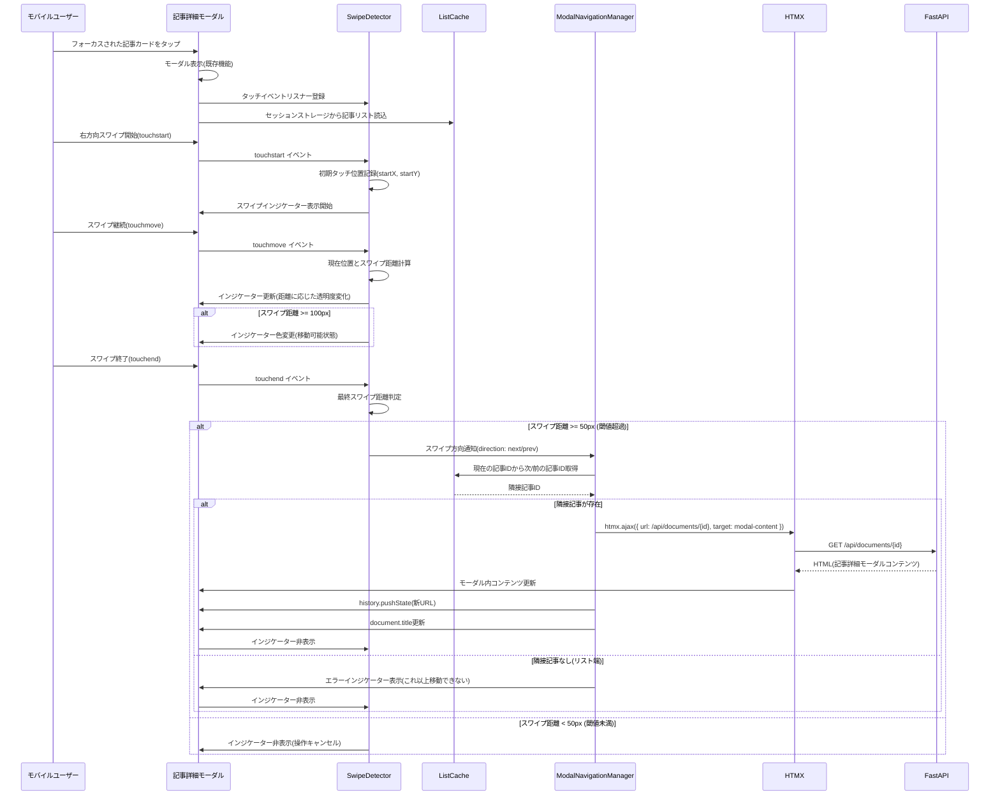
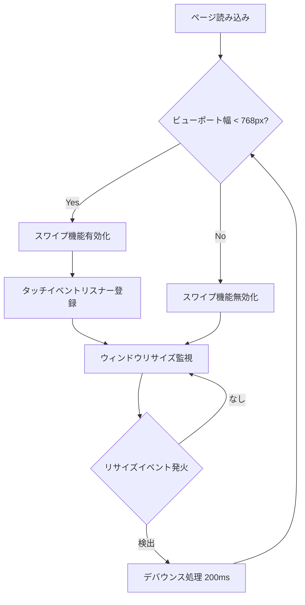
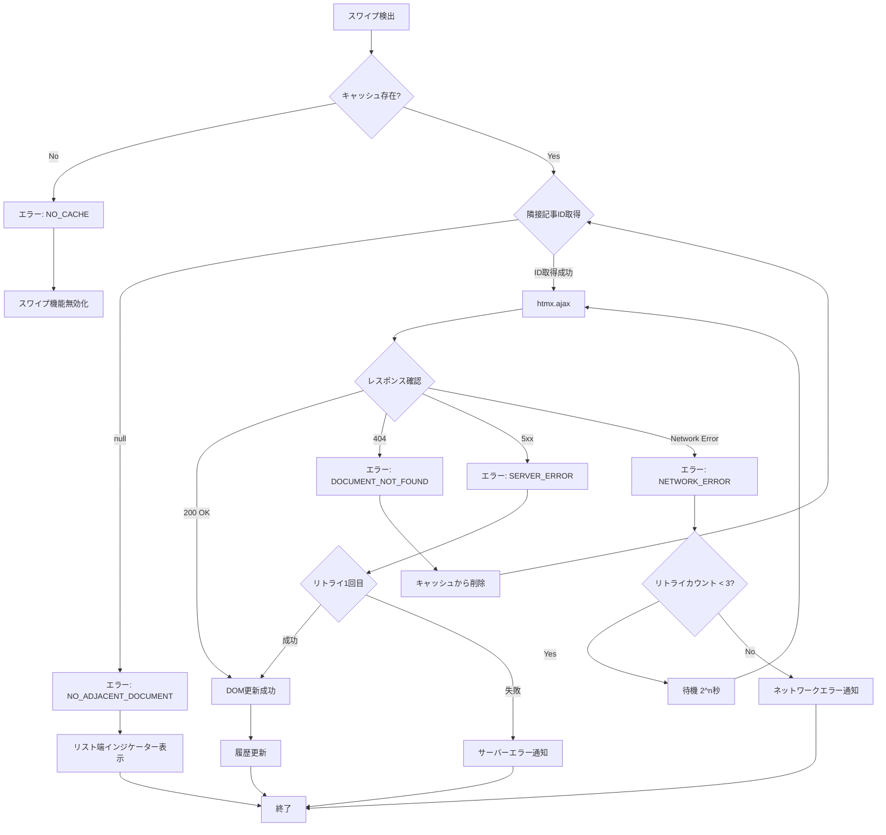
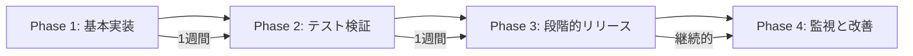

# Technical Design Document: モバイルスワイプナビゲーション

## Overview

本機能は、Scrap-Boardのドキュメント一覧ページおよび記事詳細モーダルにおいて、モバイルデバイス利用時に左右のスワイプジェスチャーで記事間を移動できる機能を提供します。ドキュメント一覧ページでは記事カードのフォーカス移動、記事詳細モーダルでは隣接記事への遷移を実現し、モバイルでの読書体験が向上します。

**Users**: モバイルデバイス(スマートフォン、タブレット)でScrap-Boardを利用するユーザーが、以下の2つのコンテキストでタッチジェスチャーによる直感的なナビゲーションを利用できます:
1. ドキュメント一覧ページ: 記事カード間のフォーカス移動とハイライト表示
2. 記事詳細モーダル: 隣接記事へのコンテンツ遷移

**Impact**: 既存のHTMXベースのページ遷移アーキテクチャと既存のモーダル表示機能を拡張し、モバイル環境においてはタッチジェスチャーによる追加のナビゲーション手段を提供します。デスクトップ環境での操作には影響を与えません。

### Goals

- モバイル環境で左右スワイプによる記事間ナビゲーションを実現
  - ドキュメント一覧: 記事カードのフォーカス移動と視覚的ハイライト
  - 記事詳細モーダル: 隣接記事へのシームレスな遷移
- HTMXの部分更新アーキテクチャと既存モーダル機能と整合したページ遷移を提供
- スワイプ操作中のリアルタイムな視覚的フィードバック表示
- デスクトップ環境への干渉を防ぐモバイル専用機能の実装

### Non-Goals

- デスクトップ環境でのスワイプジェスチャー対応
- グリッドレイアウト対応(現在存在しないため考慮不要)
- タッチデバイス以外(マウス操作)でのスワイプエミュレーション
- 記事リストの動的な再取得や無限スクロール
- ページネーション単位のスワイプ移動(記事カード単位のみ)

## Architecture

### Existing Architecture Analysis

**現在のアーキテクチャパターン**:
- **HTMXベースの部分更新**: `hx-get`, `hx-post`, `hx-target`属性によるAJAX的なコンテンツ更新
- **サーバーサイドレンダリング**: Jinja2テンプレートでHTML生成、最小限のJavaScript
- **ドキュメント一覧とナビゲーション**: `/documents`エンドポイントで記事リスト取得、`/{document_id}`で詳細表示
- **ブラウザ履歴管理**: `hx-push-url="true"`でURL履歴にプッシュ

**既存の統合ポイント**:
- `app/templates/documents.html`: ドキュメント一覧ページのテンプレート
- `app/templates/partials/document_card.html`: 記事カードコンポーネント
- `app/templates/partials/modal_content.html`: 記事詳細モーダルのコンテンツ
- `app/api/routes/documents.py`: ドキュメント一覧・詳細取得API
- `app/static/js/modal.js`: 既存のモーダル表示JavaScript
- `app/static/js/`: 既存JavaScriptファイル(htmx-minimal.js, icons.js等)

**保持すべきパターン**:
- HTMXによる部分更新とURL履歴管理
- Vanilla JavaScriptによる最小限のクライアントサイド処理
- サーバーサイドでのテンプレートレンダリング

### High-Level Architecture



**Architecture Integration**:
- **既存パターン保持**: HTMXによる部分更新、Jinja2テンプレート、Vanilla JavaScript、既存モーダル機能
- **新規コンポーネント追加**:
  - SwipeGestureDetector(タッチイベント処理)
  - CardFocusManager(一覧ページでのカードフォーカス制御)
  - ModalNavigationManager(モーダル内記事遷移制御)
  - DocumentListCache(記事リストキャッシュ)
  - SwipeIndicator(視覚的フィードバック表示)
- **技術スタック整合**: FastAPI + Jinja2 + HTMX + Vanilla JavaScript構成を維持
- **Steering原則準拠**: シンプルさ重視、最小限のJavaScript、テスト重視の原則に従う

### Technology Alignment

本機能は既存システムへの拡張として設計されるため、新規技術スタックは導入せず、既存のアーキテクチャパターンに準拠します。

**フロントエンド**:
- **Vanilla JavaScript**: タッチイベント処理(touchstart, touchmove, touchend)とスワイプジェスチャー検出を実装
- **既存HTMX拡張**: 既存の`htmx-minimal.js`をそのまま活用し、プログラマティックにHTMXリクエストをトリガー
- **Tailwind CSS**: スワイプインジケーターのスタイリングに既存のTailwindクラスを使用

**バックエンド**:
- **既存APIエンドポイント活用**: `GET /api/documents/{document_id}`を利用(新規エンドポイント不要)
- **Jinja2テンプレート**: 部分更新用のHTMLフラグメントレンダリング

**新規依存関係**: なし(既存のJavaScript APIとHTMXのみ使用)

### Key Design Decisions

#### Decision 1: タッチイベントAPIとPointer Eventsの選択

**Decision**: Touch Events API(touchstart, touchmove, touchend)を使用

**Context**: モバイルスワイプジェスチャーを実装する際、Touch Events APIとPointer Events APIの2つの選択肢があります。

**Alternatives**:
1. **Touch Events API**: モバイル専用のタッチイベント(touchstart, touchmove, touchend)
2. **Pointer Events API**: タッチ、マウス、スタイラスを統一的に扱うモダンAPI
3. **Hammer.js等のライブラリ**: ジェスチャー検出ライブラリを導入

**Selected Approach**: Touch Events APIを採用

**Rationale**:
- **要件との整合性**: 本機能はモバイル専用であり、デスクトップ環境では無効化されるため、タッチ専用APIで十分
- **既存パターンとの一貫性**: Scrap-BoardはVanilla JavaScriptを採用しており、外部ライブラリ導入を避ける方針
- **ブラウザサポート**: Touch Events APIは全モバイルブラウザで広くサポートされており、互換性リスクが低い
- **実装のシンプルさ**: Pointer Eventsよりもタッチ専用APIの方が、モバイル専用機能としては実装が直感的

**Trade-offs**:
- **メリット**: 軽量、外部依存なし、モバイルブラウザでの安定動作
- **デメリット**: 将来的にマウス操作対応を追加する場合、Pointer Events APIへの移行が必要

#### Decision 2: 記事リスト管理とキャッシュ戦略

**Decision**: セッションストレージを使用した記事リストキャッシュ

**Context**: スワイプで次/前の記事に遷移するには、現在表示中の記事が記事一覧のどの位置にあるかを特定し、隣接する記事IDを取得する必要があります。

**Alternatives**:
1. **サーバーサイドでの隣接記事取得**: APIで`/api/documents/{id}/adjacent`を実装
2. **セッションストレージキャッシュ**: ドキュメント一覧ページで記事IDリストをキャッシュ
3. **ページ内データ属性**: 記事詳細ページのHTMLに次/前の記事IDを埋め込む

**Selected Approach**: セッションストレージを使用した記事リストキャッシュ

**Rationale**:
- **クライアント完結**: サーバーサイド変更なしで実装可能、既存APIエンドポイントへの影響なし
- **パフォーマンス**: ネットワークリクエスト不要でリスト参照が高速
- **柔軟性**: フィルタリング条件(カテゴリ、タグ、検索クエリ)に応じたリストを保持可能
- **セッション限定**: ブラウザタブごとに独立したキャッシュでデータ整合性を維持

**Trade-offs**:
- **メリット**: 高速、サーバー負荷なし、既存アーキテクチャへの影響最小
- **デメリット**: ユーザーが直接URLで記事詳細ページにアクセスした場合、キャッシュが存在しないためスワイプ無効化(許容範囲内)

#### Decision 3: HTMX統合とページ遷移方式

**Decision**: HTMXのプログラマティックトリガーとhx-push-urlによる履歴管理

**Context**: スワイプで記事を切り替える際、既存のHTMXベースの部分更新アーキテクチャと整合させる必要があります。

**Alternatives**:
1. **Fetch APIで直接取得**: `fetch()`でHTMLを取得し、DOM操作で更新
2. **HTMXプログラマティックトリガー**: `htmx.ajax()`でHTMXリクエストをトリガー
3. **window.location.href変更**: ページ全体をリロード

**Selected Approach**: HTMXプログラマティックトリガー(`htmx.ajax()`)

**Rationale**:
- **既存パターンの再利用**: 通常のリンククリック時と同じHTMX部分更新フローを踏襲
- **履歴管理の一貫性**: `hx-push-url`相当の処理で自動的にブラウザ履歴にプッシュ
- **エラーハンドリング**: HTMXの既存エラーハンドリング機構を活用
- **メンテナンス性**: HTMLテンプレート側の`hx-get`定義と同じ挙動を保証

**Trade-offs**:
- **メリット**: 既存アーキテクチャとの整合性、実装の簡潔さ、エラーハンドリング共有
- **デメリット**: HTMXライブラリへの依存(ただし既にプロジェクトで採用済み)

## System Flows

### ドキュメント一覧ページでのスワイプフォーカス移動フロー



### 記事詳細モーダルでのスワイプナビゲーションフロー



### モバイル環境判定フロー



## Requirements Traceability

| Requirement | Requirement Summary | Components | Interfaces | Flows |
|-------------|---------------------|------------|------------|-------|
| 1.1-1.5 | スワイプジェスチャー検出 | SwipeGestureDetector | touchstart/touchmove/touchend handlers | 両フロー共通 |
| 2.1-2.5 | モバイル環境判定 | ViewportDetector | checkIsMobile(), handleResize() | モバイル環境判定フロー |
| 3.1-3.7 | 記事リスト参照とナビゲーション | DocumentListCache, CardFocusManager, ModalNavigationManager | getAdjacentDocumentId(), moveFocus(), navigateToDocument() | 両フロー |
| 4.1-4.5 | UI/UXフィードバック | SwipeIndicator, CardFocusManager | showIndicator(), updateIndicator(), setFocus() | 両フロー |
| 5.1-5.5 | HTMX統合とページ遷移 | ModalNavigationManager, HTMX | htmx.ajax(), history.pushState() | モーダルナビゲーションフロー |
| 6.1-6.5 | エラーハンドリングとフォールバック | ErrorHandler | handleNetworkError(), showErrorToast() | モーダルナビゲーションフロー(異常系) |
| 7.1-7.5 | パフォーマンスと応答性 | SwipeGestureDetector, CardFocusManager, ModalNavigationManager | デバウンス処理, requestAnimationFrame | 両フロー |
| 8.1-8.5 | アクセシビリティ考慮 | SwipeIndicator, AriaManager, CardFocusManager | setAriaAttributes(), announceNavigation(), setFocus() | 両フロー |

## Components and Interfaces

### フロントエンド層

#### SwipeGestureDetector

**Responsibility & Boundaries**:
- **Primary Responsibility**: モバイルデバイスでのタッチイベントを監視し、スワイプジェスチャーを検出
- **Domain Boundary**: UI入力層(タッチイベント処理)
- **Data Ownership**: スワイプ開始位置、移動距離、スワイプ方向の計算結果
- **Transaction Boundary**: 単一スワイプジェスチャーのライフサイクル(touchstart〜touchend)

**Dependencies**:
- **Inbound**: NavigationManager(スワイプ検出時にナビゲーション処理を委譲)
- **Outbound**: SwipeIndicator(視覚的フィードバック表示)
- **External**: なし(Vanilla JavaScript標準API使用)

**Contract Definition**:

```typescript
interface SwipeGestureDetector {
  // スワイプ検出の初期化と有効化
  initialize(targetElement: HTMLElement): void;

  // スワイプ機能の有効/無効切り替え
  enable(): void;
  disable(): void;

  // タッチイベントハンドラ
  handleTouchStart(event: TouchEvent): void;
  handleTouchMove(event: TouchEvent): void;
  handleTouchEnd(event: TouchEvent): void;
}

interface SwipeEvent {
  direction: 'left' | 'right';
  distance: number;
  duration: number;
}

// イベントコールバック
type SwipeCallback = (event: SwipeEvent) => void;
```

**Preconditions**:
- `initialize()`呼び出し前にターゲット要素がDOM上に存在すること
- モバイル環境判定でスワイプ機能が有効と判断されていること

**Postconditions**:
- スワイプ検出時、閾値を超えたスワイプのみSwipeCallbackを発火
- touchmove中、視覚的フィードバックがリアルタイムで更新される

**Invariants**:
- スワイプ距離は常に50px以上で検出(最小閾値)
- 水平方向の移動距離が垂直方向の移動距離の2倍以上の場合のみスワイプと判定

#### DocumentListCache

**Responsibility & Boundaries**:
- **Primary Responsibility**: ドキュメント一覧ページから記事IDリストを取得し、セッションストレージでキャッシュ
- **Domain Boundary**: クライアントサイドデータ管理層
- **Data Ownership**: 記事IDリスト、現在の記事インデックス
- **Transaction Boundary**: ブラウザセッション単位(タブごと)

**Dependencies**:
- **Inbound**: NavigationManager(隣接記事ID取得リクエスト)
- **Outbound**: なし
- **External**: sessionStorage(Web Storage API)

**Contract Definition**:

```typescript
interface DocumentListCache {
  // ドキュメント一覧ページでリストを保存
  saveDocumentList(documentIds: number[]): void;

  // 現在の記事IDから次/前の記事IDを取得
  getAdjacentDocumentId(currentId: number, direction: 'next' | 'prev'): number | null;

  // キャッシュの存在確認
  hasCachedList(): boolean;

  // キャッシュクリア
  clearCache(): void;
}

interface CachedDocumentList {
  documentIds: number[];
  timestamp: number;
  filterParams: {
    category?: string;
    tag?: string;
    query?: string;
  };
}
```

**Preconditions**:
- `saveDocumentList()`がドキュメント一覧ページで呼び出されていること

**Postconditions**:
- `getAdjacentDocumentId()`は、リスト内に隣接記事が存在する場合そのIDを、存在しない場合nullを返す
- リスト端(最初/最後)の記事では、対応する方向の隣接記事IDはnull

**Invariants**:
- キャッシュされた記事IDリストは読み取り専用(一度保存したら変更不可)
- セッションストレージのデータはタブクローズ時に自動削除

#### CardFocusManager

**Responsibility & Boundaries**:
- **Primary Responsibility**: ドキュメント一覧ページでの記事カードフォーカス状態を管理し、スワイプによるフォーカス移動を制御
- **Domain Boundary**: UI状態管理層(ドキュメント一覧ページ専用)
- **Data Ownership**: 現在フォーカスされている記事カードのインデックス、ハイライト状態
- **Transaction Boundary**: 単一フォーカス移動操作

**Dependencies**:
- **Inbound**: SwipeGestureDetector(スワイプイベントを受信)
- **Outbound**: DocumentListCache(記事リスト参照), DOM API(カードハイライト操作)
- **External**: Element.scrollIntoView(), classList API

**Contract Definition**:

```typescript
interface CardFocusManager {
  // 初期フォーカス設定(先頭カード)
  initialize(): void;

  // スワイプ方向に応じてフォーカス移動
  moveFocus(direction: 'next' | 'prev'): boolean;

  // 現在フォーカスされているカードのインデックスを取得
  getCurrentFocusIndex(): number;

  // 指定インデックスのカードにフォーカス設定
  setFocus(index: number): void;

  // フォーカスカードをタップして詳細モーダルを開く
  openFocusedCard(): void;
}

interface FocusState {
  currentIndex: number;
  totalCards: number;
  focusedCardElement: HTMLElement | null;
}
```

**Preconditions**:
- ドキュメント一覧ページに記事カードが1つ以上存在すること
- 各記事カードにdata-document-id属性が設定されていること

**Postconditions**:
- フォーカス移動時、前のカードからハイライトクラス削除、新しいカードにハイライトクラス追加
- フォーカスされたカードがビューポート内に表示される(scrollIntoView)
- リスト端でのフォーカス移動試行時、エッジインジケーター表示

**Invariants**:
- 常に1つのカードのみがフォーカス状態(複数フォーカス禁止)
- フォーカスインデックスは0以上、totalCards未満の範囲内

#### ModalNavigationManager

**Responsibility & Boundaries**:
- **Primary Responsibility**: 記事詳細モーダル内でのスワイプジェスチャー検出時の記事遷移ロジックを制御
- **Domain Boundary**: ナビゲーション制御層(記事詳細モーダル専用)
- **Data Ownership**: 現在の記事ID、遷移履歴
- **Transaction Boundary**: 単一記事遷移のライフサイクル

**Dependencies**:
- **Inbound**: SwipeGestureDetector(モーダル内スワイプイベントを受信)
- **Outbound**: DocumentListCache(隣接記事ID取得), HTMX(コンテンツ取得), ErrorHandler(エラー処理)
- **External**: HTMX(htmx.ajax), History API(history.pushState)

**Contract Definition**:

```typescript
interface ModalNavigationManager {
  // スワイプ方向に応じた記事遷移(モーダル内コンテンツ更新)
  navigateToAdjacentDocument(direction: 'next' | 'prev'): Promise<void>;

  // 現在の記事IDを設定
  setCurrentDocumentId(id: number): void;

  // ナビゲーション可否チェック
  canNavigate(direction: 'next' | 'prev'): boolean;

  // モーダルコンテンツ更新後の初期化
  reinitialize(newDocumentId: number): void;
}

interface NavigationResult {
  success: boolean;
  documentId?: number;
  error?: NavigationError;
}

type NavigationError =
  | { type: 'NO_ADJACENT_DOCUMENT'; message: string }
  | { type: 'NETWORK_ERROR'; message: string }
  | { type: 'NO_CACHE'; message: string };
```

**Preconditions**:
- `setCurrentDocumentId()`で現在の記事IDが設定されていること
- DocumentListCacheにキャッシュが存在すること
- 記事詳細モーダルが開いていること

**Postconditions**:
- 遷移成功時、モーダル内コンテンツが新しい記事に更新される
- 遷移成功時、ブラウザ履歴に新しいURLがプッシュされる
- 遷移成功時、document.titleが新しい記事タイトルに更新される
- 遷移失敗時、ErrorHandlerを通じてユーザーにエラー通知される

**Invariants**:
- 重複ナビゲーション防止(デバウンス200ms)
- ナビゲーション中は新たなスワイプを受け付けない
- モーダルが閉じられた場合、ナビゲーション機能は無効化

#### SwipeIndicator

**Responsibility & Boundaries**:
- **Primary Responsibility**: スワイプ操作中の視覚的フィードバックを表示
- **Domain Boundary**: UI表示層(視覚的フィードバック)
- **Data Ownership**: インジケーターの表示状態、スタイル
- **Transaction Boundary**: 単一スワイプジェスチャーの表示ライフサイクル

**Dependencies**:
- **Inbound**: SwipeGestureDetector(スワイプ進捗状況を受信)
- **Outbound**: なし
- **External**: DOM API, requestAnimationFrame

**Contract Definition**:

```typescript
interface SwipeIndicator {
  // インジケーター表示開始
  show(direction: 'left' | 'right'): void;

  // スワイプ距離に応じた更新
  update(distance: number, threshold: number): void;

  // インジケーター非表示
  hide(): void;

  // エラー状態表示(リスト端到達時)
  showError(message: string): void;
}

interface IndicatorStyle {
  opacity: number;      // 0〜1、スワイプ距離に応じて変化
  scale: number;        // 0.5〜1.0、スワイプ距離に応じて拡大
  color: string;        // 閾値到達前: gray、到達後: emerald
  iconType: 'arrow-left' | 'arrow-right' | 'x-circle';
}
```

**Preconditions**:
- インジケーター用のHTML要素がDOM上に存在すること(初期状態はdisplay:none)

**Postconditions**:
- `show()`呼び出し後、インジケーターが画面上に表示される
- `update()`呼び出し時、requestAnimationFrameで滑らかなアニメーション実行
- `hide()`呼び出し後、インジケーターが非表示になる

**Invariants**:
- 表示中のインジケーターは常に1つのみ
- アニメーション中の状態変更はキューイングされ、順次実行

#### ViewportDetector

**Responsibility & Boundaries**:
- **Primary Responsibility**: ビューポート幅を監視し、モバイル環境かデスクトップ環境かを判定
- **Domain Boundary**: 環境検出層
- **Data Ownership**: 現在のビューポート幅、モバイル判定状態
- **Transaction Boundary**: ウィンドウリサイズイベントごと

**Dependencies**:
- **Inbound**: SwipeGestureDetector(モバイル判定結果を通知)
- **Outbound**: なし
- **External**: window.innerWidth, ResizeObserver

**Contract Definition**:

```typescript
interface ViewportDetector {
  // モバイル環境判定
  isMobile(): boolean;

  // リサイズ監視開始
  startMonitoring(callback: (isMobile: boolean) => void): void;

  // リサイズ監視停止
  stopMonitoring(): void;
}

const MOBILE_BREAKPOINT = 768; // Tailwind mdブレークポイント
```

**Preconditions**:
- なし(ブラウザ標準APIのみ使用)

**Postconditions**:
- `isMobile()`は現在のビューポート幅が768px未満の場合trueを返す
- `startMonitoring()`呼び出し後、ウィンドウリサイズ時にコールバックが発火

**Invariants**:
- リサイズイベントはデバウンス処理(200ms)を適用
- モバイル⇔デスクトップ切り替え時のみコールバック発火(状態変化検出)

#### ErrorHandler

**Responsibility & Boundaries**:
- **Primary Responsibility**: スワイプナビゲーション中のエラーを統一的に処理
- **Domain Boundary**: エラー処理層
- **Data Ownership**: エラーログ、リトライカウント
- **Transaction Boundary**: 単一エラー発生からリカバリまで

**Dependencies**:
- **Inbound**: NavigationManager(エラー通知を受信)
- **Outbound**: SwipeIndicator(エラー表示), ToastNotification(トースト通知)
- **External**: console.error

**Contract Definition**:

```typescript
interface ErrorHandler {
  // エラーハンドリング
  handleError(error: NavigationError): void;

  // リトライ処理
  retry(operation: () => Promise<void>, maxRetries: number): Promise<void>;

  // エラーログ記録
  logError(error: Error): void;
}

interface ErrorRecoveryStrategy {
  NO_ADJACENT_DOCUMENT: () => void;  // リスト端到達エラー: インジケーター表示のみ
  NETWORK_ERROR: () => void;          // ネットワークエラー: トースト通知 + リトライ
  NO_CACHE: () => void;               // キャッシュなし: スワイプ機能無効化
}
```

**Preconditions**:
- エラー発生時、エラータイプが定義済みのNavigationErrorのいずれかであること

**Postconditions**:
- エラーハンドリング後、ユーザーに適切なフィードバック表示
- リトライ可能エラーは最大3回までリトライ

**Invariants**:
- エラーログは常にコンソールに出力
- ユーザーへのエラー通知は非ブロッキング(トースト通知)

#### AriaManager

**Responsibility & Boundaries**:
- **Primary Responsibility**: スワイプインジケーターとナビゲーション状態のARIA属性管理
- **Domain Boundary**: アクセシビリティ層
- **Data Ownership**: ARIA属性値、スクリーンリーダー通知テキスト
- **Transaction Boundary**: 単一ナビゲーションイベント

**Dependencies**:
- **Inbound**: SwipeIndicator, NavigationManager
- **Outbound**: なし
- **External**: DOM API(setAttribute, ariaLive領域)

**Contract Definition**:

```typescript
interface AriaManager {
  // インジケーターにARIA属性を設定
  setIndicatorAriaAttributes(element: HTMLElement, state: 'active' | 'success' | 'error'): void;

  // ナビゲーション完了をスクリーンリーダーに通知
  announceNavigation(documentTitle: string): void;

  // 代替ナビゲーションボタンを提供
  enableAlternativeNavigation(): void;
}

interface AriaAttributes {
  role: 'status' | 'alert';
  ariaLive: 'polite' | 'assertive';
  ariaAtomic: 'true' | 'false';
}
```

**Preconditions**:
- DOM上にaria-live領域が存在すること

**Postconditions**:
- スクリーンリーダーユーザーに適切な音声フィードバック提供
- 代替ナビゲーションボタンがキーボード操作可能

**Invariants**:
- ARIA属性は常にWCAG 2.1 AAレベル準拠
- スクリーンリーダー通知はpolite優先(緊急エラー時のみassertive)

### バックエンド層

#### Document Detail Endpoint (既存)

**Integration Strategy**:
- **Modification Approach**: 既存エンドポイント`GET /api/documents/{document_id}`をそのまま活用(変更不要)
- **Backward Compatibility**: 既存のリンククリック、HTMX部分更新と完全互換
- **Migration Path**: 段階的なフロントエンド実装のみ(バックエンド変更なし)

## Data Models

### Logical Data Model

本機能で扱うデータは既存のDocumentエンティティを参照するのみであり、新規データモデルは不要です。

**使用する既存エンティティ**:
- **Document**: 記事情報(id, title, url, content, created_at等)
- **Classification**: 記事の分類情報(primary_category, tags)
- **Bookmark**: ブックマーク情報(パーソナライズドソート時の除外に使用)

### Data Contracts & Integration

#### セッションストレージスキーマ

```typescript
interface SessionStorageSchema {
  // キー: 'scrapboard:document_list'
  document_list: {
    documentIds: number[];
    timestamp: number;
    filterParams: {
      category?: string;
      tag?: string;
      query?: string;
      sort?: string;
    };
  };
}
```

**Validation Rules**:
- `documentIds`: 空配列禁止、重複ID禁止
- `timestamp`: Unix timestamp(ミリ秒)
- `filterParams`: オプショナル、URLクエリパラメータと一致

**Serialization Format**: JSON(JSON.stringify/JSON.parse)

## Error Handling

### Error Strategy

スワイプナビゲーション機能のエラーハンドリングは、ユーザー体験を損なわないよう、グレースフルデグラデーションを基本方針とします。

### Error Categories and Responses

#### User Errors (クライアント起因エラー)

**NO_ADJACENT_DOCUMENT** (リスト端到達):
- **検出**: DocumentListCache.getAdjacentDocumentId()がnullを返す
- **処理**: SwipeIndicatorで「これ以上移動できません」メッセージ表示(1秒後自動消去)
- **リカバリ**: スワイプ機能は継続有効(逆方向スワイプは可能)

**NO_CACHE** (キャッシュ不在):
- **検出**: DocumentListCache.hasCachedList()がfalseを返す
- **処理**: スワイプ機能を自動的に無効化、警告ログ出力
- **リカバリ**: ドキュメント一覧ページに戻り、キャッシュ保存後に再度詳細ページにアクセス

#### System Errors (サーバー/ネットワークエラー)

**NETWORK_ERROR** (ネットワーク障害):
- **検出**: htmx.ajax()がfetchエラーをスロー
- **処理**: トースト通知「記事の読み込みに失敗しました。リトライ中...」表示
- **リカバリ**: 最大3回まで自動リトライ(指数バックオフ: 1秒、2秒、4秒)、全失敗時は「ネットワークエラー」トースト表示

**SERVER_ERROR** (5xx応答):
- **検出**: htmx.ajax()が500/502/503/504応答を受信
- **処理**: トースト通知「サーバーエラーが発生しました」表示
- **リカバリ**: 1回のみリトライ、失敗時はスワイプ操作キャンセル

#### Business Logic Errors

**DOCUMENT_NOT_FOUND** (記事削除済み):
- **検出**: htmx.ajax()が404応答を受信
- **処理**: トースト通知「記事が見つかりません」表示
- **リカバリ**: DocumentListCacheから該当記事IDを削除、次の隣接記事へスキップ

### Process Flow Visualization



### Monitoring

#### エラーログ記録

**クライアント側ログ**:
- `console.error()`でブラウザコンソールに出力
- エラータイプ、タイムスタンプ、スタックトレースを記録
- 将来的な拡張: ローカルストレージにエラーログ保存(オプション)

**記録項目**:
```typescript
interface ErrorLog {
  timestamp: number;
  errorType: string;
  message: string;
  documentId?: number;
  direction?: 'next' | 'prev';
  retryCount?: number;
  stackTrace?: string;
}
```

#### ヘルスモニタリング

**クライアント側メトリクス**:
- スワイプ成功率: 成功回数 / 総スワイプ試行回数
- 平均ナビゲーション時間: touchend〜DOM更新完了までの時間
- エラー発生率: エラー回数 / 総スワイプ試行回数

**将来的な拡張**:
- サーバーサイドでのアクセスログ分析
- エラーレートがしきい値超過時のアラート

## Testing Strategy

### Unit Tests

**SwipeGestureDetector**:
1. スワイプ距離計算の正確性検証(50px閾値判定)
2. 水平/垂直方向判定ロジック(horizontal restraint)
3. touchstart/touchmove/touchendイベントハンドラの動作確認
4. デバウンス処理の正常動作(200ms)

**DocumentListCache**:
1. セッションストレージへの保存/読み込み検証
2. 隣接記事ID取得ロジック(next/prev、リスト端処理)
3. キャッシュ存在確認の正確性
4. 無効なキャッシュデータのハンドリング

**CardFocusManager**:
1. フォーカス移動ロジック(next/prev、リスト端処理)
2. ハイライトクラスの追加/削除の正確性
3. scrollIntoView()の呼び出し確認
4. 複数フォーカス禁止の検証

**ModalNavigationManager**:
1. htmx.ajax()呼び出しパラメータ検証(モーダルターゲット指定)
2. history.pushState()の正常動作確認
3. 重複ナビゲーション防止(デバウンス)
4. エラーハンドリングフローの網羅的テスト
5. モーダルクローズ時のナビゲーション無効化

### Integration Tests

**ドキュメント一覧ページでのフォーカス移動統合フロー**:
1. SwipeGestureDetector → CardFocusManager → DocumentListCache の連携確認
2. カードハイライト表示とスクロール動作の検証
3. フォーカスカードタップでモーダル表示の確認

**記事詳細モーダルでのナビゲーション統合フロー**:
1. SwipeGestureDetector → ModalNavigationManager → DocumentListCache の連携確認
2. HTMX部分更新とモーダルコンテンツ書き換えの検証
3. ブラウザ履歴への正常なURL追加
4. エラー発生時のリトライ処理とフォールバック

**モバイル環境判定とスワイプ有効化**:
1. ビューポート幅768px未満でスワイプ機能有効化
2. ビューポート幅768px以上でスワイプ機能無効化
3. ウィンドウリサイズ時の動的切り替え

**セッションストレージとの統合**:
1. ドキュメント一覧ページでのキャッシュ保存
2. モーダル内でのキャッシュ読み込みと隣接記事取得
3. タブクローズ後のキャッシュクリア確認

### E2E/UI Tests (Playwright)

**ドキュメント一覧ページでのスワイプフォーカス移動フロー**:
1. ドキュメント一覧ページ表示 → 先頭カードに自動フォーカス確認
2. 左スワイプで次のカードにフォーカス移動、ハイライト表示確認
3. 右スワイプで前のカードに戻る、ハイライト解除確認
4. フォーカスカードタップで詳細モーダル表示確認
5. リスト端でのスワイプ時エッジインジケーター表示確認

**記事詳細モーダルでのスワイプナビゲーションフロー**:
1. フォーカスカードタップ → モーダル表示確認
2. モーダル内で右スワイプ → 次の記事に遷移、タイトル変更確認
3. モーダル内で左スワイプ → 前の記事に戻る、タイトル変更確認
4. リスト端でのスワイプ時エラーインジケーター表示確認

**視覚的フィードバックの検証**:
1. スワイプ中のインジケーター表示(opacity, scale変化)
2. 閾値到達時のインジケーター色変更(gray → emerald)
3. スワイプ終了時のインジケーター非表示

**エラーハンドリングの動作確認**:
1. ネットワークエラーシミュレーション時のリトライ処理
2. 404エラー時のトースト通知表示
3. キャッシュなし状態でのスワイプ無効化

**アクセシビリティ検証**:
1. ARIA属性の正常設定(role="status", aria-live="polite")
2. スクリーンリーダーでのナビゲーション通知確認
3. 代替ナビゲーションボタンのキーボード操作

### Performance/Load Tests

**スワイプ応答性**:
1. touchstart〜視覚的フィードバック開始までの時間が50ms以内
2. touchend〜htmx.ajax()リクエスト発行までの時間が300ms以内
3. コンテンツ取得〜DOM更新完了までの時間が500ms以内(ネットワーク除く)

**メモリ使用量**:
1. 連続20回のスワイプ操作後のメモリリーク確認
2. セッションストレージサイズの妥当性検証(記事1000件で10KB以下)

**デバウンス処理の効率性**:
1. 短時間に複数スワイプ実行時、重複リクエスト発生しないことを確認
2. リサイズイベント連続発火時のCPU使用率確認

## Security Considerations

### Input Validation

**セッションストレージデータ検証**:
- **脅威**: 悪意あるユーザーがセッションストレージを改ざんし、不正な記事IDを注入
- **対策**: 記事ID取得時、数値型検証と範囲チェック(1以上の整数のみ許可)
- **実装**: `Number.isInteger(id) && id > 0`で検証、不正値はスキップ

**XSS対策**:
- **脅威**: スワイプインジケーターのメッセージ表示時のXSS
- **対策**: エラーメッセージはすべてハードコードされた定数から取得、ユーザー入力を直接表示しない
- **実装**: Jinja2のautoescapeを活用(既存のテンプレートエンジン設定に依存)

### Performance & Scalability

#### Target Metrics

**レスポンスタイム**:
- スワイプ検出〜視覚的フィードバック: 50ms以内
- ナビゲーション開始〜DOM更新完了: 800ms以内(ネットワークレイテンシ含む)

**スループット**:
- 1分間に最大30回のスワイプナビゲーション処理(平均2秒に1回)
- デバウンス処理により、連続スワイプは200ms間隔で制御

#### Scaling Approaches

**クライアントサイドスケーリング**:
- **水平スケーリング**: 不要(クライアントサイド処理のみ)
- **最適化**: requestAnimationFrameによる滑らかなアニメーション、デバウンス処理による無駄なリクエスト削減

**サーバーサイドスケーリング**:
- **既存アーキテクチャ活用**: 本機能は既存の`GET /api/documents/{id}`エンドポイントを利用するため、追加のサーバー負荷は最小限
- **キャッシュ戦略**: FastAPI側のHTTPキャッシュヘッダー活用(既存実装に依存)

#### Caching Strategies

**セッションストレージキャッシュ**:
- **TTL**: タブクローズまで(セッション単位)
- **無効化条件**: フィルタ条件変更時(category, tag, query変更)
- **容量**: 記事1000件で約10KB(記事IDのみ保存)

**ブラウザHTTPキャッシュ**:
- **活用**: HTMX部分更新時、ブラウザのHTTPキャッシュを活用(既存動作)
- **無効化**: 記事更新時はサーバー側でCache-Controlヘッダー制御(既存実装)

## Migration Strategy

本機能は既存システムへの追加機能であり、段階的なロールアウトが可能です。



### Phase 1: 基本実装 (1週間)

**実装内容**:
1. SwipeGestureDetector、DocumentListCache、NavigationManagerの実装
2. ドキュメント一覧ページでのキャッシュ保存処理追加
3. 記事詳細ページでのスワイプ機能初期化

**Validation Checkpoints**:
- ユニットテストで各コンポーネントの動作確認
- ローカル環境でのモバイルエミュレータテスト

### Phase 2: テスト検証 (1週間)

**実装内容**:
1. 統合テスト、E2Eテスト(Playwright)の実装
2. SwipeIndicator、ErrorHandlerの実装
3. アクセシビリティ対応(ARIA属性、代替ナビゲーション)

**Validation Checkpoints**:
- 全テストスイート合格
- Chrome DevToolsでのパフォーマンス検証(50ms以内のフィードバック)

### Phase 3: 段階的リリース (1週間)

**実装内容**:
1. Feature Flagによるベータリリース(環境変数で有効化)
2. 限定ユーザーでの動作確認
3. エラーログ監視とフィードバック収集

**Rollback Triggers**:
- スワイプ成功率が80%未満
- 重大なエラー(JSエラー、画面フリーズ)が発生
- ユーザーからの否定的フィードバックが多数

### Phase 4: 監視と改善 (継続的)

**実装内容**:
- エラーログの定期確認(週次)
- パフォーマンスメトリクスの監視
- ユーザーフィードバックに基づく改善

**Success Metrics**:
- スワイプ成功率 > 95%
- 平均ナビゲーション時間 < 800ms
- エラー発生率 < 2%
