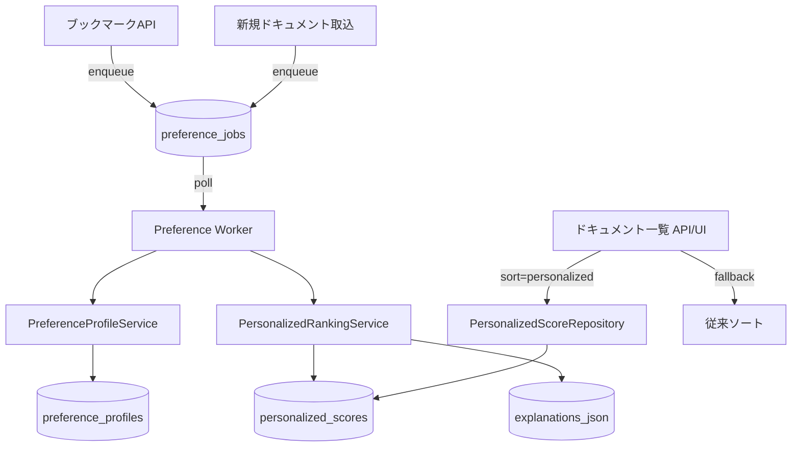

# Design Document

## Overview

ブックマーク履歴からユーザー嗜好プロファイルを生成し、新着コンテンツを関連度順に提示するパーソナライズ機能を実装する。バックグラウンドで嗜好プロファイルを更新し、事前計算したスコアを `/documents` 一覧やHTMXパーシャルから取得することで、レスポンス性能と説明可能性の両立を図る。

## Steering Document Alignment

### Technical Standards (tech.md)
- 既存のFastAPIモノリス構成とサービス層分離方針を維持し、新規ロジックは `app/services/` 配下に配置する。
- LLMクライアントは既存の `LLMClient` を再利用し、外部APIへの通信はこれを経由することで抽象レイヤーを統一する。
- 全処理はローカルDBとローカルLLMで完結し、技術方針で定められた「単一コンテナで完結」を崩さない。
- バックグラウンドジョブは既存のDBキューワーカー（`postprocess_queue` パターン）を踏襲し、指数バックオフ付きの信頼性要件を満たす。

### Project Structure (structure.md)
- `app/services/preference_profile.py` を新設し、嗜好プロファイル計算を担当させる。
- `app/services/personalized_ranking.py` を追加し、スコア計算と説明生成を一元化する。
- `app/api/routes/documents.py` と `app/templates/documents.html` に最小限の変更でソート切り替えと説明UIを追加する。
- 新規DBテーブルは `migrations/006_create_preference_tables.sql`（仮）で管理し、既存 `migrations` ディレクトリ構造に従う。

## Code Reuse Analysis

### Existing Components to Leverage
- **`Bookmark` モデル / `bookmark_service`**: ブックマーク追加時のイベントフックを再利用し、嗜好更新ジョブを発行する。
- **`postprocess_queue.enqueue_job_for_document` パターン**: DBキューベースの非同期処理と指数バックオフ実装を流用し、新ジョブキューを実装する。
- **`similarity.calculate_document_similarity`**: 既存のコサイン類似度ロジックを抽出再利用し、ユーザーベクトルとドキュメント埋め込みの類似度計算に適用する。
- **`LLMClient.create_embedding`**: ブックマークメモや抽出要約からユーザープロファイルベクトルを生成する際に利用する。
- **`templates/partials/notification` 等のHTMX UI基盤**: 推薦理由UIやソートトグルの表示でスタイルとJSユーティリティを再利用する。

### Integration Points
- **`app/api/routes/bookmarks.py`**: ブックマーク作成／削除時に嗜好更新ジョブを発行し、非同期処理開始を保証する。
- **`app/api/routes/documents.py`**: クエリパラメータ `sort=personalized` により `PersonalizedScoreRepository` を介してランキングを取得する。
- **`app/services/postprocess.py`**: ドキュメント埋め込み生成完了後にスコア再計算ジョブを発行し、新規ドキュメントをパーソナライズ結果に含める。
- **`templates/documents.html` & `templates/partials/document_card.html`**: スコア表示と推薦理由のUI拡張。

## Architecture

ブックマークイベントと新規ドキュメント取り込みの双方から更新ジョブを発行し、ワーカーが嗜好プロファイルおよびパーソナライズ済みスコアを計算する。計算結果は専用テーブルにキャッシュされ、一覧表示時は軽量クエリで取得する。

### Modular Design Principles
- **Single File Responsibility**: 嗜好計算、スコア算出、UI整形をそれぞれ専用モジュールに分割する。
- **Component Isolation**: プロファイル計算とスコア計算はインターフェースを介して連携し、直接DBを共有しない。
- **Service Layer Separation**: APIルートはサービス層経由でデータ取得し、SQLAlchemyクエリを直接持たない。
- **Utility Modularity**: 類似度計算や説明生成ロジックはユーティリティ化してテスト可能にする。



## Components and Interfaces

### PreferenceProfileService
- **Purpose:** ブックマーク集合からユーザー嗜好ベクトルとカテゴリ・ドメイン重みを算出する。
- **Interfaces:** `update_profile(user_id: Optional[str], db: Session) -> PreferenceProfileDTO`
- **Dependencies:** `LLMClient`, `Bookmark`/`Document` ORM, `numpy`
- **Reuses:** 既存埋め込み生成（`LLMClient.create_embedding`）、`similarity` のベクトル処理補助

### PersonalizedRankingService
- **Purpose:** プロファイルと未読ドキュメントを入力にスコアと説明要素を計算する。
- **Interfaces:** `score_documents(profile: PreferenceProfileDTO, documents: List[Document]) -> List[PersonalizedScoreDTO]`
- **Dependencies:** `PreferenceProfileService` DTO, `Embeddings`, `Classification`
- **Reuses:** `calculate_document_similarity` を内部利用し、カテゴリ一致・ドメイン親和性を合成
- **Scoring Contract:** `score = 0.5 * similarity + 0.25 * category_affinity + 0.15 * domain_affinity + 0.1 * freshness_decay`
   - `similarity`: ユーザープロファイル埋め込みとドキュメント埋め込み（chunk0）とのコサイン類似度。
   - `category_affinity`: プロファイルのカテゴリ重みマップから主要カテゴリの重みを参照し、0〜1へ正規化。
   - `domain_affinity`: 過去ブックマークのドメイン頻度に基づく0〜1スコア。
   - `freshness_decay`: $\exp\left(-\frac{\text{hours since created}}{72}\right)$ により、直近72時間を優遇する。
   - スコアは0〜1にクリップし、`rank` は高スコア順に1起算で付与する。

### PersonalizationJobDispatcher
- **Purpose:** ブックマークイベントおよびドキュメント処理完了時にジョブを登録する。
- **Interfaces:** `enqueue_profile_update(document_id: str, user_id: Optional[str])`, `enqueue_recompute_for_document(document_id: str)`
- **Dependencies:** 新規 `preference_jobs` テーブル、`SessionLocal`
- **Reuses:** `postprocess_queue` の `enqueue_job_for_document` 実装パターン

### PreferenceWorker
- **Purpose:** `preference_jobs` をポーリングし、プロフィール更新とスコア再計算を実施する常駐ワーカー。
- **Interfaces:** `run_worker(poll_interval: float = 2.0)`
- **Dependencies:** `PreferenceProfileService`, `PersonalizedRankingService`
- **Reuses:** 既存ワーカーループのログ／バックオフ実装思想を踏襲

### PersonalizedScoreRepository
- **Purpose:** `personalized_scores` テーブルから高速に結果を取得し、API/UIへ渡す。
- **Interfaces:** `get_scores_for_user(user_id: Optional[str], limit: int, offset: int) -> List[PersonalizedScoreDTO]`, `bulk_upsert(scores: List[PersonalizedScoreDTO])`
- **Dependencies:** SQLAlchemy `Session`, 新規モデル
- **Reuses:** 既存 `Document` リレーションを活用し、テンプレート向けに `document` を eager load

### ExplanationPresenter
- **Purpose:** スコア構成要素（カテゴリ一致度、ドメイン頻度、類似度）を日本語テキストに整形する。
- **Interfaces:** `render(reason: ExplanationBreakdown) -> str`
- **Dependencies:** `jinja2` テンプレート断片 or プレーンテキスト生成
- **Reuses:** `templates/partials` の通知スタイル・アイコン

## Data Models

### PreferenceProfile
```
PreferenceProfile (新規テーブル: preference_profiles)
- id: TEXT (UUID)
- user_id: TEXT, nullable (現状NULL=匿名ユーザー)
- bookmark_count: INTEGER
- profile_embedding: TEXT (JSON-encoded List[float])
- category_weights: TEXT (JSON map: category -> weight)
- domain_weights: TEXT (JSON map: domain -> weight)
- last_bookmark_id: TEXT (最新ブックマーク追跡)
- updated_at: DATETIME
- created_at: DATETIME
```

### PersonalizedScore
```
PersonalizedScore (新規テーブル: personalized_scores)
- id: TEXT (UUID)
- user_id: TEXT, nullable
- document_id: TEXT (FK -> documents.id)
- score: FLOAT (0〜1正規化)
- rank: INTEGER (順位キャッシュ)
- components: TEXT (JSON {"similarity": float, "category": float, "domain": float, "freshness": float})
- explanation: TEXT (日本語文章)
- computed_at: DATETIME
- UNIQUE(user_id, document_id)
```

### PreferenceFeedback
```
PreferenceFeedback (新規テーブル: preference_feedbacks)
- id: TEXT (UUID)
- user_id: TEXT, nullable
- document_id: TEXT
- feedback_type: TEXT ("low_relevance" 等)
- metadata: TEXT (JSON)
- created_at: DATETIME
```

## Error Handling

### Error Scenarios
1. **埋め込み生成失敗:**
   - **Handling:** LLMクライアント例外時は1回リトライ、失敗時はプロファイルを `status=cold_start` で保存し、UIへフォールバックを通知。
   - **User Impact:** 推薦ソート選択時に「パーソナライズが未有効です」メッセージを表示。

2. **ジョブ処理上限到達:**
   - **Handling:** `preference_jobs` は `max_attempts=3` で指数バックオフ、失敗時は `failed` マークと警告ログを出力し、管理者向けのメトリクスに計上。
   - **User Impact:** ランキングはデフォルト順で表示、UIトーストで「一時的に標準ソートを利用しています」を表示。

3. **データ不整合（ドキュメント削除済み）:**
   - **Handling:** スコア再計算時に `document_id` が存在しなければ該当行を削除し、ジョブを成功扱いで終了。
   - **User Impact:** リストから該当エントリが消えるだけでエラー表示は行わない。

## Testing Strategy

### Unit Testing
- `PreferenceProfileService` のプロファイル生成ロジック（平均ベクトル・カテゴリ集計）の単体テスト。
- `PersonalizedRankingService` のスコア合成と正規化、説明テキスト整形のテスト。
- `PersonalizedScoreRepository.bulk_upsert` の重複排他と更新動作検証。

### Integration Testing
- `tests/test_documents_personalized.py`（新規）で`sort=personalized` クエリ時のレスポンス順序とフォールバック挙動を検証。
- ブックマークAPIからジョブ発行→ワーカー処理→スコア反映までを `tmp_test_db` を用いたエンドツーエンドで確認。
- フィードバック登録 (`feedback_type=low_relevance`) 後にプロファイル再計算キューが積まれることを確認。

### End-to-End Testing
- Playwrightテストにソートトグル操作と推薦理由表示検証を追加し、日本語テキストの表示をスクリーンショット比較で確認。
- コールドスタート（ブックマーク2件以下）時に「パーソナライズ無効」表示とデフォルトソートが維持されることをUIテストで確認。
