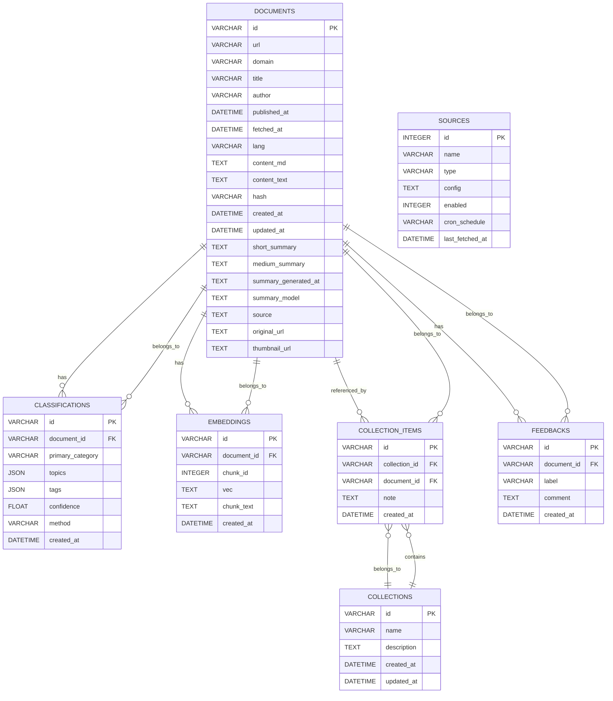

# ER Diagram

以下は現在のデータベーススキーマに基づくER図です。

```mermaid
erDiagram
    DOCUMENTS {
        VARCHAR id PK
        VARCHAR url
        VARCHAR domain
        VARCHAR title
        VARCHAR author
        DATETIME published_at
        DATETIME fetched_at
        VARCHAR lang
        TEXT content_md
        TEXT content_text
        VARCHAR hash
        DATETIME created_at
        DATETIME updated_at
        TEXT short_summary
        TEXT medium_summary
        TEXT summary_generated_at
        TEXT summary_model
        TEXT source
        TEXT original_url
        TEXT thumbnail_url
    }

    CLASSIFICATIONS {
        VARCHAR id PK
        VARCHAR document_id FK
        VARCHAR primary_category
        JSON topics
        JSON tags
        FLOAT confidence
        VARCHAR method
        DATETIME created_at
    }

    EMBEDDINGS {
        VARCHAR id PK
        VARCHAR document_id FK
        INTEGER chunk_id
        TEXT vec
        TEXT chunk_text
        DATETIME created_at
    }

    COLLECTIONS {
        VARCHAR id PK
        VARCHAR name
        TEXT description
        DATETIME created_at
        DATETIME updated_at
    }

    COLLECTION_ITEMS {
        VARCHAR id PK
        VARCHAR collection_id FK
        VARCHAR document_id FK
        TEXT note
        DATETIME created_at
    }

    FEEDBACKS {
        VARCHAR id PK
        VARCHAR document_id FK
        VARCHAR label
        TEXT comment
        DATETIME created_at
    }

    SOURCES {
        INTEGER id PK
        VARCHAR name
        VARCHAR type
        TEXT config
        INTEGER enabled
        VARCHAR cron_schedule
        DATETIME last_fetched_at
    }

    DOCUMENTS ||--o{ CLASSIFICATIONS : "has"
    DOCUMENTS ||--o{ EMBEDDINGS : "has"
    DOCUMENTS ||--o{ COLLECTION_ITEMS : "referenced_by"
    DOCUMENTS ||--o{ FEEDBACKS : "has"
    COLLECTIONS ||--o{ COLLECTION_ITEMS : "contains"
    CLASSIFICATIONS }o--|| DOCUMENTS : "belongs_to"
    EMBEDDINGS }o--|| DOCUMENTS : "belongs_to"
    COLLECTION_ITEMS }o--|| COLLECTIONS : "belongs_to"
    COLLECTION_ITEMS }o--|| DOCUMENTS : "belongs_to"
    FEEDBACKS }o--|| DOCUMENTS : "belongs_to"

``` 

注:
- `tags` と `topics` はJSON型で保存されます（Postgresでは配列型/JSONBの想定）。
- `sources` テーブルはマイグレーション `002_add_sources_and_thumbnails.sql` により追加されています。

