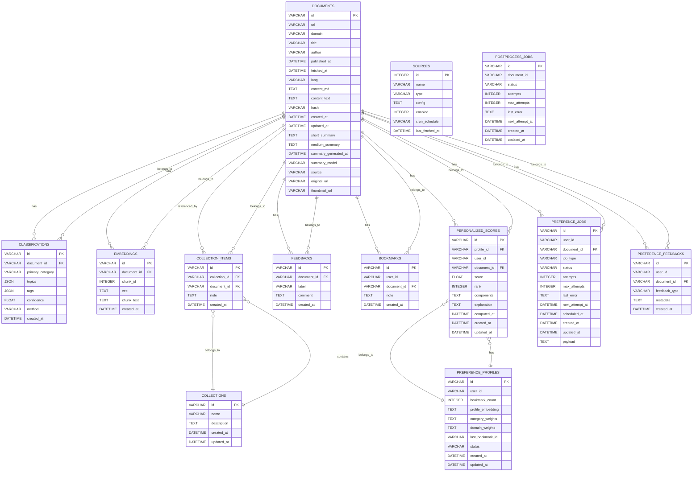

# ER Diagram

以下は現在のデータベーススキーマに基づくER図です。

## 注記

### データ型について
- `tags` と `topics` はJSON型で保存されます（Postgresでは配列型/JSONBの想定）。
- `vec` は埋め込みベクトルをJSON形式でエンコードして保存します。
- `profile_embedding`, `category_weights`, `domain_weights`, `components`, `explanation`, `metadata` はJSON文字列として保存されます。

### マイグレーション履歴
- **マイグレーション 003**: `sources` テーブルと `documents` テーブルへの `source`, `original_url`, `thumbnail_url`, `fetched_at` カラムの追加
- **マイグレーション 004**: `postprocess_jobs` テーブルの作成（ポストプロセスジョブ管理）
- **マイグレーション 005**: `bookmarks` テーブルの作成（ユーザーブックマーク機能）
- **マイグレーション 006**: パーソナライゼーション関連テーブルの作成
  - `preference_profiles`: ユーザー嗜好プロファイル
  - `personalized_scores`: パーソナライズされたドキュメントスコア
  - `preference_jobs`: 嗜好プロファイル再計算ジョブ
  - `preference_feedbacks`: パーソナライズフィードバック

### テーブル説明

#### コアテーブル
- **documents**: 収集したウェブコンテンツやPDFの本文・メタデータを保存
- **classifications**: ドキュメントの分類情報（カテゴリ、トピック、タグ）
- **embeddings**: ドキュメントの埋め込みベクトル（検索・類似度計算用）
- **sources**: RSS フィードや外部APIなどのコンテンツソース定義

#### コレクション管理
- **collections**: ユーザーが作成するドキュメントのグループ
- **collection_items**: コレクションとドキュメントの中間テーブル
- **feedbacks**: 分類結果に対するユーザーフィードバック

#### ジョブ管理
- **postprocess_jobs**: バックグラウンドでの要約生成や分類処理のジョブキュー

#### パーソナライゼーション機能
- **bookmarks**: ユーザーがブックマークしたドキュメント
- **preference_profiles**: ユーザーごとの嗜好プロファイル（ブックマーク履歴から生成）
- **personalized_scores**: ドキュメントのパーソナライズスコア（推薦順位付け用）
- **preference_jobs**: 嗜好プロファイルの再計算ジョブ
- **preference_feedbacks**: パーソナライズ結果に対するユーザーフィードバック

