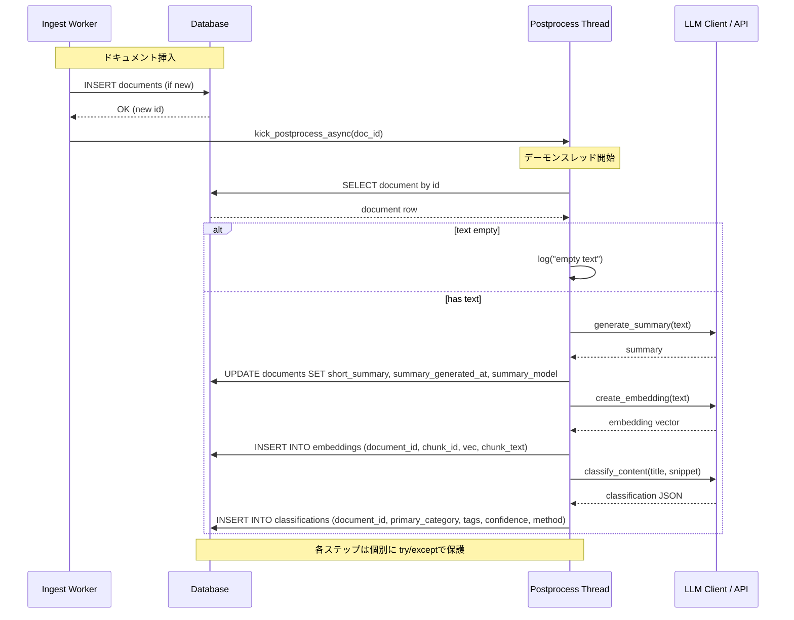

# ポストプロセッシング（Postprocessing）

このドキュメントはリポジトリ内のポストプロセッシング機能の実装概要、処理フロー、注意点、および改善提案をまとめたものです。

## 概要

ポストプロセッシングは、ドキュメントを取り込んだ直後に非同期で実行される処理群です。主に以下を実行します：

- 短い要約（short summary）の生成
- 埋め込み（embedding）の作成と保存
- コンテンツ分類（classification）の実行

これにより、取り込んだドキュメントが検索やUI表示で即座に利用できるようになります。

## 実装フロー（現状）

- ドキュメントの挿入は `app/services/ingest_worker.py` の `_insert_document_if_new` で行われる。
- 挿入成功時に `_insert_document_if_new` は `kick_postprocess_async(doc_id)` を呼び出す。
- `kick_postprocess_async` は `threading.Thread` をデーモンで起動し、`_process_doc_sync(doc_id)` を実行する。
- `_process_doc_sync` の内部では以下を順に行う：
  1. DBから `Document` を取得
  2. 文章を要約用に整形（`content_extractor.prepare_text_for_summary`）
  3. `llm_client.generate_summary` を `asyncio.run` 経由で呼び、結果を `Document.short_summary` に保存
  4. `llm_client.create_embedding` を `asyncio.run` で呼び、`Embedding` テーブルに1チャンクとして保存
  5. `llm_client.classify_content` を `asyncio.run` で呼び、`Classification` レコードを作成
  6. 各ステップは個別に try/except で保護され、失敗はログに記録される

## 関連ファイル

- `app/services/postprocess.py` — ポストプロセス本体と `kick_postprocess_async`
- `app/services/ingest_worker.py` — ドキュメント挿入とポストプロセス呼び出し
- `app/services/llm_client.py` — 要約、埋め込み、分類のAPI呼び出しラッパ
- `app/core/database.py` — `Document`, `Embedding`, `Classification` のスキーマ
- `tests/test_postprocess.py` — 単体テスト（`llm_client` をモック）
- `scripts/test_postprocess.py` — 手動確認用スクリプト

## 利点

- 実装がシンプルで分かりやすく、取り込みパスがブロッキングされない。
- テストが存在し、`llm_client` をモックすることでCIでも検証可能。
- 最小限の構成で早期に要約／埋め込みが得られるためUX向上に貢献する。

## リスク・注意点

- 現在はデーモンスレッド + `asyncio.run` の組み合わせで非同期処理を実装しているため、同時実行数が増えるとスレッド数とリソース消費が増大する。
- デーモンスレッドはプロセス終了時に強制終了されるため、シャットダウン時の未完了ジョブが失われる可能性がある。
- 失敗時のリトライや永続的なジョブ管理がなく、一時的なLLM障害で要約/埋め込みが欠落することがある。
- 埋め込みは全文を1チャンクで作成する単純実装で、長文の分割や複数チャンク保存は未対応。
- 分類のJSONパースはLLMの出力形式に依存しており、不正な出力に対して脆弱である。

## 改善提案（優先度付き）

### 高優先度（推奨）

- ワーカーキューの導入（Celery / RQ / Dramatiq など）
  - 利点: 再試行、可視化、スケーリング、ジョブ永続化が容易になる。
- 失敗ジョブの再試行とエラー記録
  - 失敗時に一定回数まで自動再試行し、それでも失敗する場合は `postprocess_failures` のようなテーブルかログに保存する。

### 中優先度

- 埋め込みのチャンク分割
  - 長文を複数チャンクに分割して埋め込みを生成・保存する（各チャンクを `Embedding.chunk_id` で区分）。
- 分類結果のバリデーション
  - JSONスキーマチェックを導入し、期待形式でなければキーワードベースのフォールバックにフォールバックする。

### 低優先度

- Vector DB（FAISS/Milvus/Weaviate）への移行
- ジョブ実行時のメトリクス（Prometheus 等）の導入

## 短期的にできる安全強化（実装パッチ案）

- `postprocess.py` に詳細なログ（job start / job end / elapsed_ms）を追加する。
- `kick_postprocess_async` を `ThreadPoolExecutor` ベースに変更して同時実行数を制限する。
- Embedding 保存時に重複チェック（document_id, chunk_id）を行う。

## 推奨次ステップ

- 運用目標に合わせて、まずはワーカーキュー（Celery など）への移行計画を立てる。
- すぐに着手できる改善として、`ThreadPoolExecutor` 化とログ強化を実装し、並列度のコントロールと可観測性を向上させる。

---

作成済み: `docs/postprocessing.md`

追加でこのファイルに以下を含めてほしい場合は教えてください:
- 実際のログ出力サンプル
- Celery を使った簡単な移行サンプルコード
- Embedding チャンク分割のサンプル実装

## ワーカーキュー導入提案

ポストプロセッシングの信頼性・拡張性を高めるためにワーカーキューの導入を推奨します。ここでは候補の比較、推奨構成、移行手順の概要、注意点を示します。

### 候補比較

- Celery
  - 長所: 豊富な機能（再試行、スケジューリング、結果バックエンド）、コミュニティ、既存の運用ノウハウが多い。
  - 短所: RabbitMQ/Redisなど追加インフラが必要。設定がやや複雑。

- RQ (Redis Queue)
  - 長所: シンプルで導入が速い。Redisのみで完結。
  - 短所: Celeryほど高度な機能はない（高度なスケジューリングやワークフロー制御は限定的）。

- Dramatiq
  - 長所: 高速でシンプル、RedisやRabbitMQをバックエンドに使用可能。自動リトライやミドルウェアが使いやすい。
  - 短所: Celeryほど成熟したエコシステムはないが十分な機能を持つ。

### 推奨

開発初期〜中規模の運用であれば `Dramatiq` または `RQ` をおすすめします。理由は導入コストが低く、Redisを1つ用意すればすぐに動作するためです。運用が拡大し、複雑なワークフローやスケジューリングが必要になれば `Celery` へ移行検討してください。

### 目標アーキテクチャ（例: Dramatiq + Redis）

- Web/API サーバー（FastAPI）: ドキュメントをDBに挿入し、ポストプロセスジョブをキューに enqueue する
- Redis: ブローカーとして使用
- Worker(s): Dramatiq ワーカーがキューからジョブを取得し、LLM呼び出し・DB更新を行う

フロー図（簡易）:

Ingest -> DB insert -> enqueue job -> Redis -> Worker -> LLM -> DB updates

### 移行手順（高レベル）

1. Redis を開発環境に導入（Docker or ローカル）
2. `dramatiq` を `requirements.txt` に追加 (`pip install dramatiq redis`)
3. 新しいタスクモジュール `app/tasks/postprocess_tasks.py` を追加し、既存の `_process_doc_sync` ロジックを移植（非同期/同期の違いに注意）
4. `ingest_worker._insert_document_if_new` から `kick_postprocess_async` 呼び出しを削除し、代わりにジョブを enqueue する（例: `postprocess_tasks.generate_for_document.send(doc_id)`）
5. ワーカー起動用の systemd / docker-compose サービスを追加
6. テスト: `tests/test_postprocess.py` を修正してジョブを同期実行または worker をテスト用に立ち上げて動作確認

### サンプルコード（Dramatiq）

以下は最小構成のサンプルです（詳細は実装時に調整してください）。

`app/tasks/postprocess_tasks.py`:

```python
import dramatiq
from dramatiq.brokers.redis import RedisBroker
from app.core.database import SessionLocal, Document, Embedding, Classification
from app.services.llm_client import llm_client
from app.services.extractor import content_extractor
from datetime import datetime
import json

redis_broker = RedisBroker()
dramatiq.set_broker(redis_broker)

@dramatiq.actor(max_retries=3, retry_when=lambda x: True)
def generate_for_document(doc_id: str):
  db = SessionLocal()
  try:
    doc = db.query(Document).filter(Document.id == doc_id).one_or_none()
    if not doc:
      return

    text = content_extractor.prepare_text_for_summary(doc.content_text or "", max_chars=20000)
    if not text:
      return

    summary = dramatiq.get_current_message().actor.loop.run_until_complete(llm_client.generate_summary(text, style="short"))
    if summary:
      doc.short_summary = summary[:2000]
      doc.summary_generated_at = datetime.utcnow()
      db.add(doc)
      db.commit()

    emb = dramatiq.get_current_message().actor.loop.run_until_complete(llm_client.create_embedding(text))
    if emb:
      emb_row = Embedding(document_id=doc.id, chunk_id=0, vec=json.dumps(emb), chunk_text=text[:1000])
      db.add(emb_row)
      db.commit()

    classification_result = dramatiq.get_current_message().actor.loop.run_until_complete(
      llm_client.classify_content(doc.title or "", (doc.content_text or "")[:2000])
    )
    if classification_result:
      cls = Classification(
        document_id=doc.id,
        primary_category=classification_result.get("primary_category", "その他"),
        topics=None,
        tags=classification_result.get("tags", []),
        confidence=classification_result.get("confidence", 0.5),
        method="llm",
      )
      db.add(cls)
      db.commit()
  finally:
    db.close()

```

注: 上記は `llm_client` が asyncio ベースであるため、actor 内での呼び出しは同期ブリッジが必要です。シンプルには `asyncio.run()` を使ってラップするか、actor を非同期で実行可能なフレームワーク（または `asyncio` 対応のブローカー）を検討してください。

### テスト方針

- 単体テスト: `llm_client` をモックし、ジョブ関数を同期的に実行して DB 更新を検証する。
- 統合テスト: Redis をテスト環境で起動し、実際に `dramatiq worker` を立ち上げて end-to-end テストを行う。

### 注意点

- ワーカーはDBとのコネクションを独自に取得する必要がある（`SessionLocal()`）。
- LLMへの同時接続数とAPIレート制限に注意し、ワーカ数や同時ジョブ数を制御する。
- シャットダウン時のジョブ完了待ち（graceful shutdown）をワーカー側で実装する。

---

このセクションは簡易提案です。実装支援（パッチ作成、`docker-compose` 追加、テスト更新）を続けますか？

### DB-backed ワーカーの起動方法（開発用）

開発中に簡易ワーカーを手動で実行するには、次のコマンドを使います。ワーカーは `postprocess_jobs` テーブルをポーリングしてジョブを処理します。

```bash
# 仮想環境を有効化してから
python -m app.services.postprocess_queue
```

プロダクションではプロセスマネージャ（systemd / supervisord / Docker）で `run_worker()` を実行するプロセスを管理してください。

## 処理シーケンス図 (Mermaid)

以下はポストプロセッシングの主要な呼び出しフローを示すシーケンス図です。読み取り順は上→下、左から右です。



図では簡易化のためエラーハンドリングや細かな前処理（text truncate、thumbnail生成など）は省略しています。
