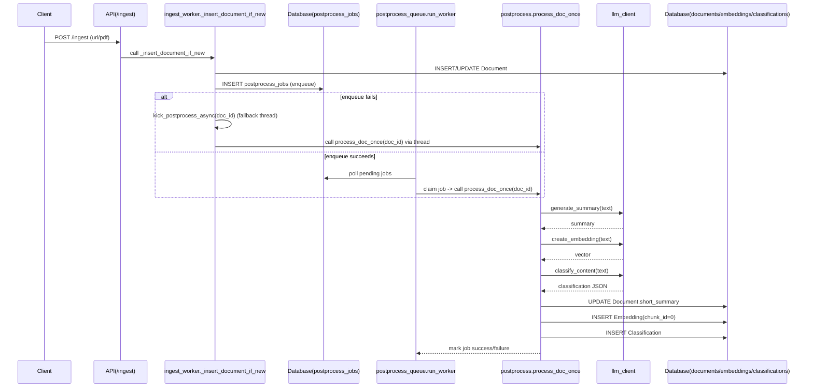

# ポストプロセッシング（Postprocessing）

このドキュメントはリポジトリ内のポストプロセッシング機能の実装概要、処理フロー、注意点、および改善提案を現在の実装に合わせて整理したものです。

## 概要

ポストプロセッシングは、ドキュメントを取り込んだ直後に非同期で実行される処理群です。主に以下を実行します：

- 短い要約（short summary）の生成
- 埋め込み（embedding）の作成と保存（現状は全文を1チャンクとして保存）
- コンテンツ分類（classification）の実行

これにより、取り込んだドキュメントが検索やUI表示で利便性を得られます。

## 現行の実装フロー（コードに基づく）

- ドキュメントの挿入は `app/services/ingest_worker.py` の `_insert_document_if_new` で行われます。
- 挿入後、まず `enqueue_job_for_document` を呼んで `postprocess_jobs` テーブルにジョブを登録します（DB-backed キュー）。
- ジョブ登録に失敗した場合はフォールバックで `kick_postprocess_async(doc_id)` を呼び出します。フォールバックは即時にデーモンスレッドを起動して処理を試みます。
- 永続化されたジョブは `app/services/postprocess_queue.py` のポーリングワーカー（`run_worker`）によって取得・処理されます。
- ワーカーはジョブを取得すると `app/services/postprocess.py` の `process_doc_once(doc_id)` を呼び出します。`process_doc_once` は (success: bool, error: Optional[str]) を返します。

以下は主要な流れを示すシーケンス図です（Mermaid形式）。

`process_doc_once` の主な処理順序：

1. 新しい SQLAlchemy エンジン／セッションを作成して `Document` を取得（環境変数 `DB_URL` を優先して接続）。
2. `content_extractor.prepare_text_for_summary` を使って要約用テキストを準備（`settings.short_summary_max_chars` に従い切り詰め）。
3. 要約生成: `llm_client.generate_summary` を内部ユーティリティ `_run_async` 経由で呼び出す。`_run_async` は、現在スレッドで実行中のイベントループの有無を検出して安全に `asyncio.run()` を実行する仕組みを持ち、pytest や他の非同期ランタイムと競合しないように設計されています。成功時は `Document.short_summary`、`summary_generated_at`、`summary_model` を更新してコミットします。
4. 埋め込み生成: `llm_client.create_embedding` を同様に呼び出し、返却されたベクトルを `Embedding` テーブルに `chunk_id=0` で保存します（現状の単純実装）。
5. 分類: `llm_client.classify_content` を呼び、JSON をパースできれば `Classification` レコードを作成して保存します。パース失敗や不正な出力はログに記録され、分類はスキップされます。
6. 各主要ステップは個別に try/except で保護され、ステップ失敗時はログに例外を出力して `process_doc_once` は失敗フラグとエラー文字列を返します。

## 関連ファイル

- `app/services/postprocess.py` — ポストプロセス本体（`process_doc_once`）とフォールバック `kick_postprocess_async`。
- `app/services/postprocess_queue.py` — DB-backed ポーリングワーカーとジョブ管理（リトライ／指数バックオフ含む）。
- `app/services/ingest_worker.py` — ドキュメント挿入とジョブ登録（enqueue）ロジック。
- `app/services/llm_client.py` — 要約、埋め込み、分類用の非同期 HTTP クライアントラッパー（`async def` メソッド）。
- `app/services/extractor.py` — コンテンツ抽出ロジック（テキスト準備等）。
- `app/core/database.py` — `Document`, `Embedding`, `Classification`, `PostprocessJob` 等のスキーマ定義。

## 設計上の要点（実装に基づく）

- 永続化ジョブ優先: 挿入経路はまず DB にジョブを作るため、ワーカーを常時稼働させればフォールバックのスレッド処理に依存しなくても安定して再試行が可能です。
- `process_doc_once` は同期関数として設計されており、内部で非同期 `llm_client` を安全に呼ぶための `_run_async` ユーティリティを持ちます。これによりテスト環境のイベントループと安全に共存します。
- `postprocess_queue.run_worker` は各ジョブが失敗すると `attempts` をインクリメントし、指数関数的に `next_attempt_at` を延ばす（バックオフ）。`attempts >= max_attempts` で `failed` にマークされます。

## 利点

- 実装はシンプルで理解しやすく、通常の挿入パスはブロッキングされません。
- ジョブを DB に登録することで永続化と再試行が可能になっている（ワーカー稼働時）。
- フォールバックのデーモンスレッドにより、enqueue に失敗した場合でも即時処理が試みられる。
- `llm_client` は非同期実装であるため、将来的にブローカー／ワーカーを asyncio 対応にすると効率化が図れる。

## リスク・注意点

- `_run_async` の仕組みで既存イベントループ下でも動作する工夫はあるが、同時に多数のデーモンスレッドが起動するとスレッドと同時 LLM 呼び出しによりリソース消費が高くなる。
- フォールバックのデーモンスレッドはプロセス終了時に強制終了されるため、シャットダウン時に未完了ジョブが失われる可能性がある。
- `postprocess_queue` が稼働していないと、DB に残ったジョブは処理されない（enqueue は成功しているがワーカーが起動していないことに注意）。
- 埋め込みは長文を1チャンクで処理するため、長い記事に対する意味的分割・複数チャンク検索は未対応。
- 分類は LLM の出力を正規表現で JSON 部分を抜き出してパースするため、出力フォーマットに依存して脆弱性がある。

## 改善提案（優先度付き、実装に即した案）

### 高優先度

- ブローカー型ワーカーへの移行（`Dramatiq` / `RQ` / `Celery` など）: 再試行、監視、スケーリング、ワーカー管理が容易になります。
- 現状を活かす短期対処: `postprocess_queue` を systemd / Docker サービスとして常時稼働させ、DB ベースの永続化 + リトライを確実に有効化する。

### 中優先度

- 埋め込みのチャンク分割: 長文を文脈的に分割して複数チャンクで埋め込みを作成・保存する（`Embedding.chunk_id` を使用）。
- 分類結果のバリデーション: JSON スキーマ検証を導入し、失敗時はキーワードベースのフォールバックを行う。

### 低優先度

- Vector DB（FAISS/Milvus/Weaviate）への移行による高速類似検索
- メトリクス（Prometheus 等）とアラートの導入

## 短期的にできる安全強化（実装パッチ案）

- `postprocess.py` にジョブ開始／終了と総経過時間（elapsed_ms）を追加でログ出力する。
- `kick_postprocess_async` を `ThreadPoolExecutor` ベースに移行して同時実行数を制限する短期パッチを検討する。
- Embedding 保存時に `document_id` + `chunk_id` の重複チェックを入れて重複挿入を防ぐ。

## 小さな実装差分メモ（現状との違いを要約）

- `ingest_worker._insert_document_if_new` は実装上、まず `enqueue_job_for_document` による DB 登録を試み、登録に失敗した際に `kick_postprocess_async` を用いるフォールバックを行います（従来ドキュメントの説明はフォールバックのみを記載していましたが、現状はDBキューが優先されています）。
- `postprocess_queue.run_worker` はポーリングワーカーで、`process_doc_once` の戻り値に基づき成功／失敗／再スケジュールを行います。
- `process_doc_once` は内部で新しい DB エンジンを作る実装になっており、テスト時にモジュールレベルの古いエンジンを参照しないよう配慮されています。

## 実装/運用チェックリスト

- **ワーカー稼働**: `postprocess_queue.run_worker` が稼働しているかを確認する（開発では `python -m app.services.postprocess_queue`）。
- **DB ジョブ確認**: `postprocess_jobs` テーブルに pending ジョブが残っていないかを監視する。
- **ログ監視**: 要約・埋め込み・分類の失敗ログを確認して問題の傾向を把握する。

---

作成済み: `docs/postprocessing.md`（このファイル）

追加でこのファイルに含めてほしい場合は教えてください:

- 実際のログ出力サンプル（要約成功 / 埋め込み失敗 など）
- `Dramatiq` を使った移行パッチ（小さなサンプルモジュールと `docker-compose` 追加）
- 埋め込みチャンク分割のサンプル実装
